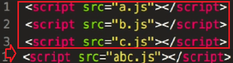
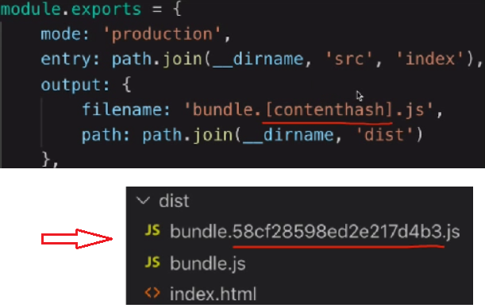
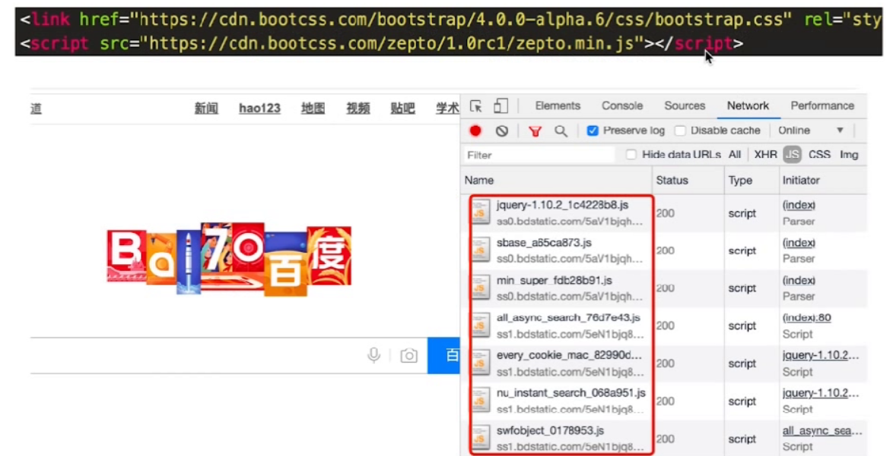
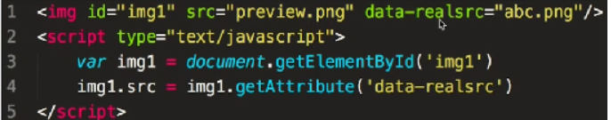
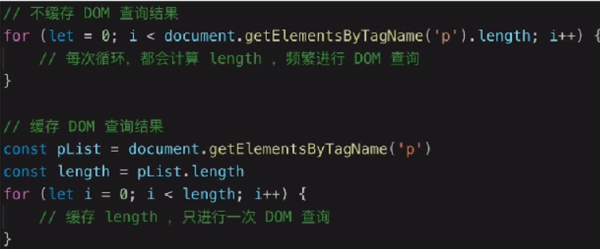
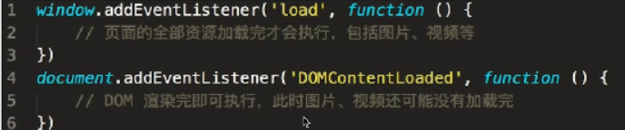

# 前端优化面试小结

## 1.从输入url到渲染出页面的整个过程

资源的形式

html代码、媒体文件（如图片、视频等）、javascript css

加载过程

> DNS解析：域名->IP地址
>
> 浏览器根据IP地址向服务器发起http请求
>
> 服务器处理http请求，并返回给浏览器

渲染过程

> 根据HTML代码生成DOM Tree
>
> 根据CSS代码生成CSSOM
>
> 将DOM Tree和CSSOM整合行程 Render Tree
>
> 根据Render Tree 渲染页面
>
> 遇到`<script>`则暂停渲染，优先加载并执行JS代码，完成再继续
>
> 直至把Render Tree 渲染完成

## 2.性能优化

### 怎么做？

多使用内存、缓存或其他方法、减少CPU计算量，减少网络加载耗时、（适用于所有编程的性能优化——空间换时间）

- 让加载更快
  - 减少资源体积：压缩代码
  - 减少访问次数：合并代码，SSR服务器端渲染，缓存
  - 使用更快的网络：CDN
- 让渲染更快
  - CSS放在head，JS放在body 最下面
  - 尽早开始执行JS，用DOMContentLoaded触发
  - 懒加载（图片懒加载，上滑加载更多）
  - 对DOM查询进行缓存
  - 频繁DOM操作，合并到一起插入DOM结构
  - 节流 throttle 防抖debbunce

### 资源合并

### 缓存

- 静态资源加hash后缀，根据文件内容计算hash
- 文件内容不变，则hash不变，则url不变
- url和文件不变，则会自动触发http缓存机制，返回304

### CDN

### SSR

服务器端渲染：将网页和数据一起加载，一起渲染

非SSR（前后端分离）：先加载网页，再加载数据，再渲染数据

早先的JSPASP PHP，现在的vue React SSR

### 懒加载

### 缓存DOM查询

### 尽早开始JS执行

## 3.安全

### XSS跨站请求攻击

> 一个博客网站，我发表一篇博客，其中嵌入`<script>`脚本
>
> 脚本内容：获取cookie，发送到我的服务器（服务器配合跨域）
>
> 发布这篇博客，有人查看它，我轻松收割访问者的cookie

### XSS 预防

> 替换特殊字符，如<变为8&lt；>变为&gt；
>
> `<script>`变为&t；script&gt；，直接显示，而不会作为脚本执行
>
> 前端要替换，后端也要替换，都做总不会有错

### XSRF跨站请求伪造

> 你正在购物，看中了某个商品，商品id是100
>
> 付费接口是xxx.com/pay？id=100，但没有任何验证
>
> 我是攻击者，我看中了一个商品，id是200
>
> 我向你发送一封电子邮件，邮件标题很吸引人
>
> 但邮件正文隐藏着
>
> 你一查看邮件，就帮我购买了id是200的商品

### XSRF预防

使用post接口

增加验证，例如密码、短信验证码、指纹等