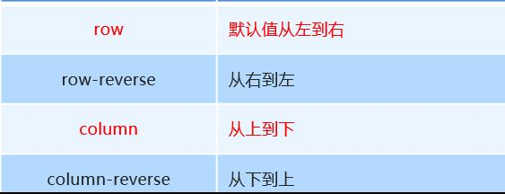
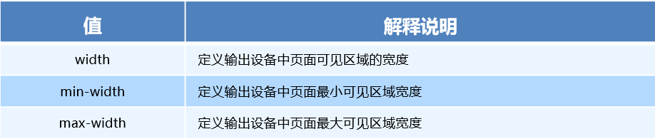

# 移动web开发布局

#### 1 布局视口 layout viewport

iOS, Android基本都将这个视口分辨率设置为 980px，所以PC上的网页大多都能在手机上呈现，只不过元素看上去很小，一般默认可以通过手动缩放网页。

#### 2视觉视口 visual viewport

字面意思，它是用户正在看到的网站的区域。注意：是网站的区域。

我们可以通过缩放去操作视觉视口，但不会影响布局视口，布局视口仍保持原来的宽度。

#### 3理想视口 ideal viewport

为了使网站在移动端有最理想的浏览和阅读宽度而设定

理想视口，对设备来讲，是最理想的视口尺寸

需要手动添写meta视口标签通知浏览器操作

meta视口标签的主要目的：布局视口的宽度应该与理想视口的宽度一致，简单理解就是设备有多宽，我们布局的视口就多宽

总结：我们开发最终会用理想视口，而理想视口就是将布局视口宽度修改为视觉视口

#### 4meta标签


最标准的viewport设置

+ 视口宽度和设备保持一致
+ 视口的默认缩放比例1.0
+ 不允许用户自行缩放
+ 最大允许的缩放比例1.0
+ 最小允许的缩放比例1.0

## 1.流式布局（百分比布局）


## 2.flex 弹性布局（强烈推荐）

### 2.1 父项常见属性

+ flex-direction：设置主轴的方向
+ justify-content：设置主轴上的子元素排列方式
+ flex-wrap：设置子元素是否换行  
+ align-content：设置侧轴上的子元素的排列方式（多行）
+ align-items：设置侧轴上的子元素排列方式（单行）
+ flex-flow：复合属性，相当于同时设置了 flex-direction 和 flex-wrap

#### 1 flex-direction设置主轴的方向

+ 在 flex 布局中，是分为主轴和侧轴两个方向，同样的叫法有 ： 行和列、x 轴和y 轴
+ 默认主轴方向就是 x 轴方向，水平向右
+ 默认侧轴方向就是 y 轴方向，水平向下



#### 2 justify-content 设置主轴上的子元素排列方式


#### 3 flex-wrap设置是否换行

+ 默认情况下，项目都排在一条线（又称”轴线”）上。flex-wrap属性定义，flex布局中默认是不换行的。
+ nowrap 不换行
+ wrap 换行

#### 4 align-items 设置侧轴上的子元素排列方式（单行 ）

+ 该属性是控制子项在侧轴（默认是y轴）上的排列方式  在子项为单项（单行）的时候使用
+ flex-start 从头部开始
+ flex-end 从尾部开始
+ center 居中显示
+ stretch 拉伸

#### 5. align-content  设置侧轴上的子元素的排列方式（多行）

设置子项在侧轴上的排列方式 并且只能用于子项出现 换行 的情况（多行），在单行下是没有效果的。

#### 6  align-content 和align-items区别

+ align-items  适用于单行情况下， 只有上对齐、下对齐、居中和 拉伸
+ align-content适应于换行（多行）的情况下（单行情况下无效）， 可以设置 上对齐、下对齐、居中、拉伸以及平均分配剩余空间等属性值。 
+ 总结就是单行找align-items  多行找 align-content

#### 7  flex-flow 属性是 flex-direction 和 flex-wrap 属性的复合属性

```
flex-flow:row wrap;
```

### 2.2 flex布局子项常见属性

+ flex子项目占的份数
+ align-self控制子项自己在侧轴的排列方式
+ order属性定义子项的排列顺序（前后顺序）

#### 1.  flex 属性

flex 属性定义子项目分配剩余空间，用flex来表示占多少份数。

```
.item {
    flex: <number>; /* 默认值 0 */
}

```

#### 2. align-self控制子项自己在侧轴上的排列方式

align-self 属性允许单个项目有与其他项目不一样的对齐方式，可覆盖 align-items 属性。

默认值为 auto，表示继承父元素的 align-items 属性，如果没有父元素，则等同于 stretch。

````
span:nth-child(2) {
      /* 设置自己在侧轴上的排列方式 */
      align-self: flex-end;
}

````

#### 3.order 属性定义项目的排列顺序

数值越小，排列越靠前，默认为0。

注意：和 z-index 不一样。

```
.item {
    order: <number>;
}
```


## 3.less+rem+媒体查询布局

### 3.1rem基础

rem (root em)是一个相对单位，类似于em，em是父元素字体大小。

不同的是rem的基准是相对于html元素的字体大小。

比如，根元素（html）设置font-size=12px; 非根元素设置width:2rem; 则换成px表示就是24px。

```
/* 根html 为 12px */
html {
   font-size: 12px;
}
/* 此时 div 的字体大小就是 24px */       
div {
    font-size: 2rem;
}
```

rem的优势：父元素文字大小可能不一致， 但是整个页面只有一个html，可以很好来控制整个页面的元素大小。

### 3.2媒体查询

媒体查询（Media Query）是CSS3新语法。

+ 使用 @media查询，可以针对不同的媒体类型定义不同的样式
+ @media 可以针对不同的屏幕尺寸设置不同的样式
+ 当你重置浏览器大小的过程中，页面也会根据浏览器的宽度和高度重新渲染页面 

#### 媒体查询语法规范

+ 用 @media开头 注意@符号
+ mediatype  媒体类型
+ 关键字 and  not  only
+ media feature 媒体特性必须有小括号包含

```
@media mediatype and|not|only (media feature) {
    CSS-Code;
}
```

1. mediatype 查询类型

​       将不同的终端设备划分成不同的类型，称为媒体类型


2. 关键字

​       关键字将媒体类型或多个媒体特性连接到一起做为媒体查询的条件。

+ and：可以将多个媒体特性连接到一起，相当于“且”的意思。
+ not：排除某个媒体类型，相当于“非”的意思，可以省略。
+ only：指定某个特定的媒体类型，可以省略。    

3. 媒体特性

   每种媒体类型都具体各自不同的特性，根据不同媒体类型的媒体特性设置不同的展示风格。




### 3.3less 基础

#### 1.维护css弊端

CSS 是一门非程序式语言，**没有变量、函数、SCOPE（作用域）**等概念。

+ CSS 需要书写大量看似没有逻辑的代码，CSS 冗余度是比较高的。
+ 不方便维护及扩展，不利于复用。
+ CSS 没有很好的计算能力

#### 2.Less 介绍 

Less（LeanerStyle Sheets 的缩写）是一门 CSS扩展语言，也成为CSS预处理器。

Less中文网址：[http://](http://lesscss.cn/)[less](http://lesscss.cn/)[css.cn/](http://lesscss.cn/)

常见的CSS预处理器：**Sass、Less、Stylus**

一句话：Less是一门 CSS 预处理语言，它**扩展了CSS的动态特性**。

##### Less安装

①安装nodejs，可选择版本(8.0)，网址：<http://nodejs.cn/download/>

②检查是否安装成功，使用cmd命令（win10是window+r 打开运行输入cmd）  ---输入“node –v”查看版本即可

③基于nodejs在线安装Less，使用cmd命令“npm install -g less”即可

④检查是否安装成功，使用cmd命令“ lessc -v ”查看版本即可

##### Less 使用之变量

变量是指没有固定的值，可以改变的。因为我们CSS中的一些颜色和数值等经常使用。

```
@变量名:值;
```

+ 必须有@为前缀
+ 不能包含特殊字符
+ 不能以数字开头
+ 大小写敏感

```
@color: pink;
```

##### Less 编译 vocode Less 插件

Easy LESS 插件用来把less文件编译为css文件

安装完毕插件，重新加载下 vscode。

只要保存一下Less文件，会自动生成CSS文件。

##### Less 嵌套

```
// 将css改为less
#header .logo {
  width: 300px;
}

#header {
    .logo {
       width: 300px;
    }
}

```

如果遇见 （交集|伪类|伪元素选择器） ，利用&进行连接

```
a:hover{
    color:red;
}
a{
  &:hover{
      color:red;
  }
}
```

##### Less 运算

任何数字、颜色或者变量都可以参与运算。就是Less提供了加（+）、减（-）、乘（*）、除（/）算术运算。

```
/*Less 里面写*/
@witdh: 10px + 5;
div {
    border: @witdh solid red;
}
/*生成的css*/
div {
  border: 15px solid red;
}
/*Less 甚至还可以这样 */
width: (@width + 5) * 2;

```

+ 乘号（*）和除号（/）的写法  
+ 运算符中间左右有个空格隔开 1px + 5
+ 对于两个不同的单位的值之间的运算，运算结果的值取第一个值的单位 
+ 如果两个值之间只有一个值有单位，则运算结果就取该单位

### 3.4.rem适配方案

1.less+rem+媒体查询

2.flexible.js+rem

## 4.响应式布局

### 4.1 响应式开发原理

就是使用媒体查询针对不同宽度的设备进行布局和样式的设置，从而适配不同设备的目的。

设备的划分情况：

+ 小于768的为超小屏幕（手机）
+ 768~992之间的为小屏设备（平板）
+ 992~1200的中等屏幕（桌面显示器）
+ 大于1200的宽屏设备（大桌面显示器）

### 4.2 响应式布局容器

响应式需要一个父级做为布局容器，来配合子级元素来实现变化效果。

原理就是在不同屏幕下，通过媒体查询来改变这个布局容器的大小，再改变里面子元素的排列方式和大小，从而实现不同屏幕下，看到不同的页面布局和样式变化。

父容器版心的尺寸划分

+ 超小屏幕（手机，小于 768px）：设置宽度为 100%
+ 小屏幕（平板，大于等于 768px）：设置宽度为 750px
+ 中等屏幕（桌面显示器，大于等于 992px）：宽度设置为 970px
+ 大屏幕（大桌面显示器，大于等于 1200px）：宽度设置为 1170px 

但是我们也可以根据实际情况自己定义划分

### 4.3Bootstrap

[中文网](lhttp://www.bootcss.com/)  [官网](lhttp://getbootstrap.com/)  [推荐网站](http://bootstrap.css88.com/)

#### 1.bootstrap基本使用

在现阶段我们还没有接触JS相关课程，所以我们只考虑使用它的样式库。

Bootstrap 使用四步曲： 

1.创建文件夹结构  

2.创建 html 骨架结构 

```html
<!DOCTYPE html>
<html lang="zh-CN">
  <head>
    <meta charset="utf-8">
    <meta http-equiv="X-UA-Compatible" content="IE=edge">
    <meta name="viewport" content="width=device-width, initial-scale=1">
    <!-- 上述3个meta标签*必须*放在最前面，任何其他内容都*必须*跟随其后！ -->
    <title>Bootstrap 101 Template</title>

    <!-- Bootstrap -->
    <link href="css/bootstrap.min.css" rel="stylesheet">

    <!-- HTML5 shim and Respond.js for IE8 support of HTML5 elements and media queries -->
    <!-- WARNING: Respond.js doesn't work if you view the page via file:// -->
    <!--[if lt IE 9]>
      <script src="//cdn.bootcss.com/html5shiv/3.7.2/html5shiv.min.js"></script>
      <script src="//cdn.bootcss.com/respond.js/1.4.2/respond.min.js"></script>
    <![endif]-->
  </head>
  <body>
    <h1>你好，世界！</h1>

    <!-- jQuery (necessary for Bootstrap's JavaScript plugins) -->
    <script src="//cdn.bootcss.com/jquery/1.11.3/jquery.min.js"></script>
    <!-- Include all compiled plugins (below), or include individual files as needed -->
    <script src="js/bootstrap.min.js"></script>
  </body>
</html>
```

3.引入相关样式文件  

```
<!-- Bootstrap 核心样式-->
<link rel="stylesheet" href="bootstrap/css/bootstrap.min.css">
```

#### 2bootstrap布局容器

Bootstrap 需要为页面内容和栅格系统包裹一个 .container 或者.container-fluid 容器，它提供了两个作此用处的类。

.container

+ 响应式布局的容器  固定宽度
+ 大屏 ( >=1200px)  宽度定为 1170px
+ 中屏 ( >=992px)   宽度定为  970px
+ 小屏 ( >=768px)   宽度定为  750px
+ 超小屏  (100%) 

.container-fluid

+ 流式布局容器 百分百宽度
+ 占据全部视口（viewport）的容器。

#### 3. bootstrap栅格系统

Bootstrap提供了一套响应式、移动设备优先的流式栅格系统，随着屏幕或视口（viewport）尺寸的增加，系统会自动分为最多12列。

栅格系统用于通过一系列的行（row）与列（column）的组合来创建页面布局，你的内容就可以放入这些创建好的布局中。

+ 按照不同屏幕划分为1~12 等份
+ 行（row） 可以去除父容器作用15px的边距
+ xs-extra small：超小； sm-small：小；  md-medium：中等； lg-large：大；
+ 列（column）大于 12，多余的“列（column）”所在的元素将被作为一个整体另起一行排列
+ 每一列默认有左右15像素的 padding
+ 可以同时为一列指定多个设备的类名，以便划分不同份数  例如 class="col-md-4 col-sm-6"

栅格嵌套

栅格系统内置的栅格系统将内容再次嵌套。简单理解就是一个列内再分成若干份小列。我们可以通过添加一个新的 .row 元素和一系列 .col-sm-* 元素到已经存在的 .col-sm-*
元素内。

```
<!-- 列嵌套 -->
 <div class="col-sm-4">
    <div class="row">
         <div class="col-sm-6">小列</div>
         <div class="col-sm-6">小列</div>
    </div>
</div>

```

列偏移

使用 .col-md-offset-* 类可以将列向右侧偏移。这些类实际是通过使用 * 选择器为当前元素增加了左侧的边距（margin）。

```
 <!-- 列偏移 -->
  <div class="row">
      <div class="col-lg-4">1</div>
      <div class="col-lg-4 col-lg-offset-4">2</div>
  </div>

```

列排序

通过使用 .col-md-push-* 和 .col-md-pull-* 类就可以很容易的改变列（column）的顺序。

```
 <!-- 列排序 -->
  <div class="row">
      <div class="col-lg-4 col-lg-push-8">左侧</div>
      <div class="col-lg-8 col-lg-pull-4">右侧</div>
  </div>

```

响应式工具

为了加快对移动设备友好的页面开发工作，利用媒体查询功能，并使用这些工具类可以方便的针对不同设备展示或隐藏页面内容。


