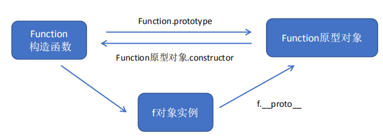
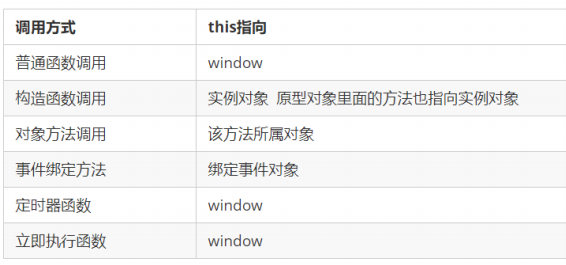
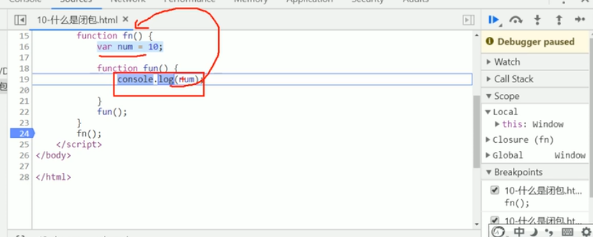

## 1. 函数的定义和调用

### 1.1 函数的定义方式


new Function()

`var fn = new Function('参数1','参数2'..., '函数体')`



### 1.2 函数的调用方式

1. 普通函数
2. 对象的方法
3. 构造函数
4. 绑定事件函数
5. 定时器函数
6. 立即执行函数
```html
<script>
        // 函数的调用方式
        // 1. 普通函数
        function fn() {
            console.log('人生的巅峰');
        }
        // fn();   fn.call()
        // 2. 对象的方法
        var o = {
            sayHi: function() {
                console.log('人生的巅峰');
            }
        }
        o.sayHi();
        // 3. 构造函数
        function Star() {};
        new Star();
        // 4. 绑定事件函数
        btn.onclick = function() {};   // 点击了按钮就可以调用这个函数
        // 5. 定时器函数
        setInterval(function() {}, 1000);  这个函数是定时器自动1秒钟调用一次
        // 6. 立即执行函数
        (function() {
            console.log('人生的巅峰');
        })();
        // 立即执行函数是自动调用
    </script>
```
## 2. this

### 2.1 函数内 this 的指向



```html
    <script>
        // 函数的不同调用方式决定了this 的指向不同
        // 1. 普通函数 this 指向window
        function fn() {
            console.log('普通函数的this' + this);
        }
        window.fn();
        // 2. 对象的方法 this指向的是对象 o
        var o = {
            sayHi: function() {
                console.log('对象方法的this:' + this);
            }
        }
        o.sayHi();
        // 3. 构造函数 this 指向 ldh 这个实例对象 原型对象里面的this 指向的也是 ldh这个实例对象
        function Star() {};
        Star.prototype.sing = function() {

        }
        var ldh = new Star();
        // 4. 绑定事件函数 this 指向的是函数的调用者 btn这个按钮对象
        var btn = document.querySelector('button');
        btn.onclick = function() {
            console.log('绑定时间函数的this:' + this);
        };
        // 5. 定时器函数 this 指向的也是window
        window.setTimeout(function() {
            console.log('定时器的this:' + this);

        }, 1000);
        // 6. 立即执行函数 this还是指向window
        (function() {
            console.log('立即执行函数的this' + this);
        })();
    </script>
```
### 2.2 改变函数内部 this 指向


#### 1. call 方法
```html
 <script>
        // 1. call()
        var o = {
            name: 'andy'
        }
        function fn(a, b) {
            console.log(this);
            console.log(a + b);
        };
        fn.call(o, 1, 2);
        // call 第一个可以调用函数 第二个可以改变函数内的this 指向
        // call 的主要作用可以实现继承
        function Father(uname, age, sex) {
            this.uname = uname;
            this.age = age;
            this.sex = sex;
        }
        function Son(uname, age, sex) {
            Father.call(this, uname, age, sex);
        }
        var son = new Son('刘德华', 18, '男');
        console.log(son);
    </script>
```
#### 2. apply 方法

```html
<script>
        // 2. apply()  应用 运用的意思
        var o = {
            name: 'andy'
        };
        function fn(arr) {
            console.log(this);
            console.log(arr); // 'pink'
        };
        fn.apply(o, ['pink']);
        // 1. 也是调用函数 第二个可以改变函数内部的this指向
        // 2. 但是他的参数必须是数组(伪数组)
        // 3. apply 的主要应用 比如说我们可以利用 apply 借助于数学内置对象求数组最大值 
        // Math.max();
        var arr = [1, 66, 3, 99, 4];
        var arr1 = ['red', 'pink'];
        // var max = Math.max.apply(null, arr);
        var max = Math.max.apply(Math, arr);
        var min = Math.min.apply(Math, arr);
        console.log(max, min);
    </script>
```
#### 3. bind 方法
```html
  <button>点击</button>
    <button>点击</button>
    <button>点击</button>
    <script>
        // 3. bind()  绑定 捆绑的意思
        var o = {
            name: 'andy'
        };
        function fn(a, b) {
            console.log(this);
            console.log(a + b);
        };
        var f = fn.bind(o, 1, 2);
        f();
        // 1. 不会调用原来的函数   可以改变原来函数内部的this 指向
        // 2. 返回的是原函数改变this之后产生的新函数
        // 3. 如果有的函数我们不需要立即调用,但是又想改变这个函数内部的this指向此时用bind
        // 4. 我们有一个按钮,当我们点击了之后,就禁用这个按钮,3秒钟之后开启这个按钮
        // var btn1 = document.querySelector('button');
        // btn1.onclick = function() {
        //     this.disabled = true; // 这个this 指向的是 btn 这个按钮
        //     // var that = this;
        //     setTimeout(function() {
        //         // that.disabled = false; // 定时器函数里面的this 指向的是window
        //         this.disabled = false; // 此时定时器函数里面的this 指向的是btn
        //     }.bind(this), 3000); // 这个this 指向的是btn 这个对象
        // }
        var btns = document.querySelectorAll('button');
        for (var i = 0; i < btns.length; i++) {
            btns[i].onclick = function() {
                this.disabled = true;
                setTimeout(function() {
                    this.disabled = false;
                }.bind(this), 2000);
            }
        }
    </script>
```
### 2.3 call apply bind 总结

#### 相同点:
都可以改变函数内部的this指向.
#### 区别点:
1. call 和 apply 会调用函数, 并且改变函数内部this指向.
2. call 和 apply 传递的参数不一样, call 传递参数 aru1, aru2..形式 apply 必须数组形式[arg]
3. bind 不会调用函数, 可以改变函数内部this指向.
主要应用场景:
1. call 经常做继承.
2. apply 经常跟数组有关系. 比如借助于数学对象实现数组最大值最小值
3. bind 不调用函数,但是还想改变this指向. 比如改变定时器内部的this指向.

## 3. 严格模式

### 3.1 什么是严格模式

ES5 的严格模式是采用具有限制性
JavaScript 变体的一种方式，即在严格的条件下运行 JS 代码

1. 消除了 Javascript 语法的一些不合理、不严谨之处，减少了一些怪异行为。
2. 消除代码运行的一些不安全之处，保证代码运行的安全。
3. 提高编译器效率，增加运行速度。
4. 禁用了在 ECMAScript 的未来版本中可能会定义的一些语法，为未来新版本的 Javascript 做好铺垫。比
如一些保留字如：class, enum, export, extends, import, super 不能做变量名

### 3.2 开启严格模式

```html
<!-- 为整个脚本(script标签)开启严格模式 -->
    <script>
        'use strict';
        //   下面的js 代码就会按照严格模式执行代码
    </script>
    <script>
        (function() {
            'use strict';
        })();
    </script>
    <!-- 为某个函数开启严格模式 -->
    <script>
        // 此时只是给fn函数开启严格模式
        function fn() {
            'use strict';
            // 下面的代码按照严格模式执行
        }

        function fun() {
            // 里面的还是按照普通模式执行
        }
    </script>
```
### 3.3 严格模式中的变化

#### 1. 变量规定
#### 2. 严格模式下 this 指向问题

>① 以前在全局作用域函数中的 this 指向 window 对象。
>② 严格模式下全局作用域中函数中的 this 是 undefined。
>③ 以前构造函数时不加 new也可以 调用,当普通函数，this 指向全局对象
>④ 严格模式下,如果 构造函数不加new调用, this 指向的是undefined 如果给他赋值则 会报错
>⑤ new 实例化的构造函数指向创建的对象实例。
>⑥ 定时器 this 还是指向 window 。
>⑦ 事件、对象还是指向调用者。
#### 3. 函数变化

>① 函数不能有重名的参数。
>② 函数必须声明在顶层.新版本的 JavaScript 会引入“块级作用域”（ ES6 中已引入）。为了与新版本接轨，
>不允许在非函数的代码块内声明函数。
```html
<script>
        'use strict';
        // 1. 我们的变量名必须先声明再使用
        // num = 10;
        // console.log(num);
        var num = 10;
        console.log(num);
        // 2.我们不能随意删除已经声明好的变量
        // delete num;
        // 3. 严格模式下全局作用域中函数中的 this 是 undefined。
        // function fn() {
        //     console.log(this); // undefined。

        // }
        // fn();
        // 4. 严格模式下,如果 构造函数不加new调用, this 指向的是undefined 如果给他赋值则 会报错.
        // function Star() {
        //     this.sex = '男';
        // }
        // // Star();
        // var ldh = new Star();
        // console.log(ldh.sex);
        // 5. 定时器 this 还是指向 window 
        // setTimeout(function() {
        //     console.log(this);

        // }, 2000);
        // a = 1;
        // a = 2;
        // 6. 严格模式下函数里面的参数不允许有重名
        // function fn(a, a) {
        //     console.log(a + a);

        // };
        // fn(1, 2);
        function fn() {}
    </script>
```


## 4. 高阶函数

高阶函数是对其他函数进行操作的函数，它接收函数作为参数或将函数作为返回值输出。

```html
 <div></div>
    <script>
        // 高阶函数- 函数可以作为参数传递
        function fn(a, b, callback) {
            console.log(a + b);
            callback && callback();
        }
        fn(1, 2, function() {
            console.log('我是最后调用的');

        });
        $("div").animate({
            left: 500
        }, function() {
            $("div").css("backgroundColor", "purple");
        })
    </script>
```
## 5. 闭包

### 5.1 变量作用域

变量根据作用域的不同分为两种：全局变量和局部变量。
1. 函数内部可以使用全局变量。
2. 函数外部不可以使用局部变量。
3. 当函数执行完毕，本作用域内的局部变量会销毁。

### 5.2 什么是闭包

**闭包（closure）指有权访问另一个函数作用域中变量的函数。**

一个作用域可以访问另外一个函数内部的局部变量。

```html
<script>
        // 闭包（closure）指有权访问另一个函数作用域中变量的函数。
        // 闭包: 我们fun 这个函数作用域 访问了另外一个函数 fn 里面的局部变量 num
        function fn() {
            var num = 10;
            function fun() {
                console.log(num);
            }
            fun();
        }
        fn();
    </script>
```
### 5.3 在 chrome 中调试闭包
1. 打开浏览器，按 F12 键启动 chrome 调试工具。
2. 设置断点。
3. 找到 Scope 选项（Scope 作用域的意思）。
4. 当我们重新刷新页面，会进入断点调试，Scope 里面会有两个参数（global 全局作用域、local 局部作用域）。
5. 当执行到 fn2() 时，Scope 里面会多一个 Closure 参数 ，这就表明产生了闭包。



### 5.3 闭包的作用
```html
 <script>
        // 闭包（closure）指有权访问另一个函数作用域中变量的函数。
        // 一个作用域可以访问另外一个函数的局部变量 
        // 我们fn 外面的作用域可以访问fn 内部的局部变量
        // 闭包的主要作用: 延伸了变量的作用范围
        function fn() {
            var num = 10;

            // function fun() {
            //     console.log(num);

            // }
            // return fun;
            return function() {
                console.log(num);
            }
        }
        var f = fn();
        f();
        // 类似于
        // var f = function() {
        //         console.log(num);
        //     }
        // var f =  function fun() {
        //         console.log(num);

        //     }
    </script>
```
### 5.5 闭包案例
```html
 <ul class="nav">
        <li>榴莲</li>
        <li>臭豆腐</li>
        <li>鲱鱼罐头</li>
        <li>大猪蹄子</li>
    </ul>
    <script>
        // 闭包应用-点击li输出当前li的索引号
        // 1. 我们可以利用动态添加属性的方式
        var lis = document.querySelector('.nav').querySelectorAll('li');
        for (var i = 0; i < lis.length; i++) {
            lis[i].index = i;
            lis[i].onclick = function() {
                // console.log(i);
                console.log(this.index);

            }
        }
        // 2. 利用闭包的方式得到当前小li 的索引号
        for (var i = 0; i < lis.length; i++) {
            // 利用for循环创建了4个立即执行函数
            // 立即执行函数也成为小闭包因为立即执行函数里面的任何一个函数都可以使用它的i这变量
            (function(i) {
                // console.log(i);
                lis[i].onclick = function() {
                    console.log(i);

                }
            })(i);
        }
    </script>
    
     <script>
        // 闭包应用-3秒钟之后,打印所有li元素的内容
        var lis = document.querySelector('.nav').querySelectorAll('li');
        for (var i = 0; i < lis.length; i++) {
            (function(i) {
                setTimeout(function() {
                    console.log(lis[i].innerHTML);
                }, 3000)
            })(i);
        }
    </script>
```
### 5.6 闭包总结

闭包是一个函数 （一个作用域可以访问另外一个函数的局部变量）

延伸变量的作用范围

## 6. 递归


如果一个**函数在内部可以调用其本身**，那么这个函数就是递归函数。
由于递归很容易发生“栈溢出”错误（stack overflow），所以**必须要加退出条件 return。**

```js
        // 利用递归函数求1~n的阶乘 1 * 2 * 3 * 4 * ..n
        function fn(n) {
            if (n == 1) {
                return 1;
            }
            return n * fn(n - 1);
        }
        console.log(fn(3));
        console.log(fn(4));
```
**浅拷贝**
```html
<script>
        // 浅拷贝只是拷贝一层, 更深层次对象级别的只拷贝引用.
        // 深拷贝拷贝多层, 每一级别的数据都会拷贝.
        var obj = {
            id: 1,
            name: 'andy',
            msg: {
                age: 18
            }
        };
        var o = {};
        // for (var k in obj) {
        //     // k 是属性名   obj[k] 属性值
        //     o[k] = obj[k];
        // }
        // console.log(o);
        // o.msg.age = 20;
        // console.log(obj);

        console.log('--------------');
        Object.assign(o, obj);
        console.log(o);
        o.msg.age = 20;
        console.log(obj);
    </script>
```
**深拷贝**
```html
 <script>
        // 深拷贝拷贝多层, 每一级别的数据都会拷贝.
        var obj = {
            id: 1,
            name: 'andy',
            msg: {
                age: 18
            },
            color: ['pink', 'red']
        };
        var o = {};
        // 封装函数 
        function deepCopy(newobj, oldobj) {
            for (var k in oldobj) {
                // 判断我们的属性值属于那种数据类型
                // 1. 获取属性值  oldobj[k]
                var item = oldobj[k];
                // 2. 判断这个值是否是数组
                if (item instanceof Array) {
                    newobj[k] = [];
                    deepCopy(newobj[k], item)
                } else if (item instanceof Object) {
                    // 3. 判断这个值是否是对象
                    newobj[k] = {};
                    deepCopy(newobj[k], item)
                } else {
                    // 4. 属于简单数据类型
                    newobj[k] = item;
                }

            }
        }
        deepCopy(o, obj);
        console.log(o);

        var arr = [];
        console.log(arr instanceof Object);
        o.msg.age = 20;
        console.log(obj);
    </script>
```