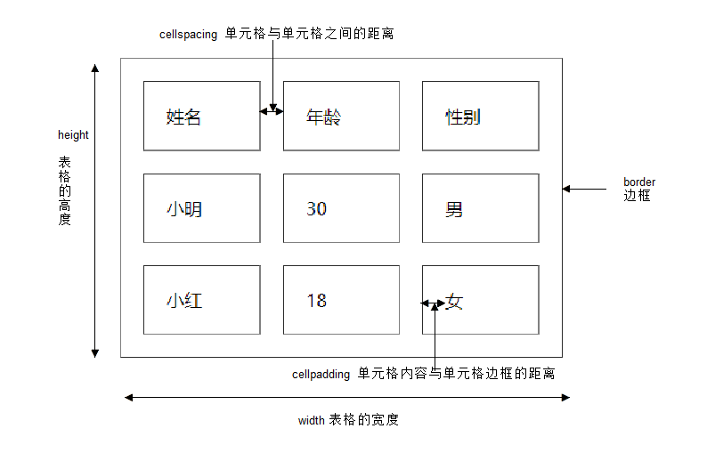

# 4.表格 table

## 4.1 创建表格

```html
<table>
  <tr>
    <td>单元格内的文字</td>
    ...
  </tr>
  ...
</table>
```


**总结： **

* 表格的主要目的是用来显示特殊数据的
* 一个完整的表格有表格标签（table），行标签（tr），单元格标签（td）组成，没有列的标签

- `<tr></tr>`中只能嵌套`<td></td>` 类的单元格
- `<td></td>`标签，他就像一个容器，可以容纳所有的元素
- 字母 td 指表格数据（table data），即数据单元格的内容，现在我们明白，表格最合适的地方就是用来存储数据的。

## 4.2 表格属性




## 4.3表头单元格标签th

- 作用：

  - 一般表头单元格位于表格的第一行或第一列，并且文本加粗居中

- 语法：

  - 只需用表头标签&lt;th&gt;</th&gt;替代相应的单元格标签&lt;td&gt;</td&gt;即可。 

```html
<table width="500" border="1" align="center" cellspacing="0" cellpadding="0">
        <tr>  
            <th>姓名</th> 
            <th>性别</th>
            <th>电话</th>
        </tr>
        <tr>
            <td>小王</td>
            <td>女</td>
            <td>110</td>
        </tr>
        <tr>
            <td>小明</td>
            <td>男</td>
            <td>120</td>
        </tr>   
    </table>
```


<table width="500" border="1" align="center" cellspacing="0" cellpadding="0">
		<tr>  
			<th>姓名</th> 
			<th>性别</th>
			<th>电话</th>
		</tr>
		<tr>
			<td>小王</td>
			<td>女</td>
			<td>110</td>
		</tr>
		<tr>
			<td>小明</td>
			<td>男</td>
			<td>120</td>
		</tr>	
	</table>

## 4.4表格标题caption

```html
<table>
   <caption>我是表格标题</caption>
</table>
```

**注意: **

1. caption 元素定义**表格标题**，通常这个标题会被居中且显示于表格之上。
2. caption 标签必须紧随 table 标签之后。

## 4.5合并单元格

###  1 合并单元格2种方式

* 跨行合并：rowspan="合并单元格的个数"      
* 跨列合并：colspan="合并单元格的个数"

### 2 合并单元格顺序

> 合并的顺序我们按照   先上 后下     先左  后右 的顺序 

### 3 合并单元格三步曲

1. 先确定是跨行还是跨列合并
2. 根据 先上 后下   先左  后右的原则找到目标单元格    然后写上 合并方式 还有 要合并的单元格数量  比如 ：` <td colspan="3">   </td>`
3. 删除多余的单元格 单元格      

## 4.6 总结表格

| 标签名                | 定义           | 说明                                         |
| --------------------- | :------------- | :------------------------------------------- |
| `<table></table>`     | 表格标签       | 就是一个四方的盒子                           |
| `<tr></tr>`           | 表格行标签     | 行标签要再table标签内部才有意义              |
| `<td></td>`           | 单元格标签     | 单元格标签是个容器级元素，可以放任何东西     |
| `<th></th>`           | 表头单元格标签 | 它还是一个单元格，但是里面的文字会居中且加粗 |
| `<caption></caption>` | 表格标题标签   | 表格的标题，跟着表格一起走，和表格居中对齐   |
| clospan 和 rowspan    | 合并属性       | 用来合并单元格的                             |


## 4.7 拓展阅读

### 表格划分结构（了解）

```
对于比较复杂的表格，表格的结构也就相对的复杂了，所以又将表格分割成三个部分：题头、正文和脚注。而这三部分分别用:thead,tbody,tfoot来标注， 这样更好的分清表格结构
```

**注意：**

1. `<thead></thead>`：用于定义表格的头部。用来放标题之类的东西。`<thead>` 内部必须拥有 `<tr>` 标签！
2. `<tbody></tbody>`：用于定义表格的主体。放数据本体 。
3. `<tfoot></tfoot>`放表格的脚注之类。
4. 以上标签都是放到table标签中。