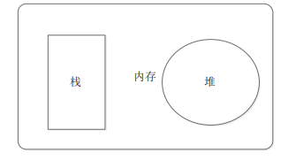
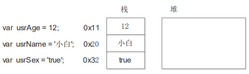
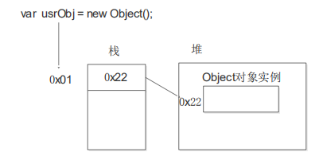

## 1. 简单类型与复杂类型

>简单类型又叫做基本数据类型或者值类型
>复杂类型又叫做引用类型。
* 值类型：简单数据类型/基本数据类型，在存储时变量中存储的是值本身，因此叫做值类型
string ，number，boolean，undefined，null
* 引用类型：复杂数据类型，在存储时变量中存储的仅仅是地址（引用），因此叫做引用数据类型
通过 new 关键字创建的对象（系统对象、自定义对象），如 Object、Array、Date等

## 2. 堆和栈

1、栈（操作系统）：由操作系统自动分配释放存放函数的参数值、局部变量的值等。其操作方式类似于数据结构中的栈；
**简单数据类型存放到栈里面**
2、堆（操作系统）：存储复杂类型(对象)，一般由程序员分配释放，若程序员不释放，由垃圾回收机制回收。
**复杂数据类型存放到堆里面**



## 3. 简单类型的内存分配

* 值类型（简单数据类型）： string ，number，boolean，undefined，null
* 值类型变量的数据直接存放在变量（栈空间）中
* 

## 4. 复杂类型的内存分配
* 引用类型（复杂数据类型）：通过 new 关键字创建的对象（系统对象、自定义对象），如 Object、Array、Date等
* 引用类型变量（栈空间）里存放的是地址，真正的对象实例存放在堆空间中


## 5. 简单类型传参
```js
function fn(a) {
a++;
console.log(a);
}
var x = 10;
fn(x);
console.log(x)；

```
## 6. 复杂类型传参

```js
function Person(name) {
this.name = name;
}
function f1(x) { // x = p
console.log(x.name); // 2. 这个输出什么 ?
x.name = "张学友";
console.log(x.name); // 3. 这个输出什么 ?
}
var p = new Person("刘德华");
console.log(p.name); // 1. 这个输出什么 ?
f1(p);
console.log(p.name); // 4. 这个输出什么 ?
```

