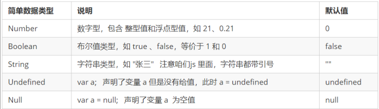
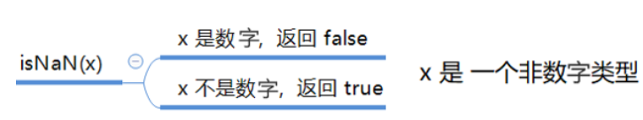
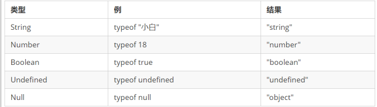
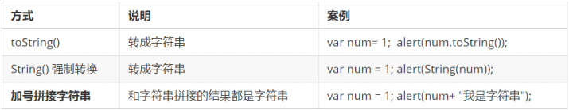
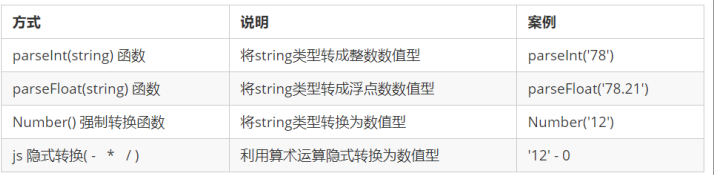
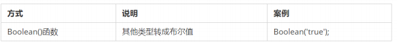

# 3.数据类型   

## 1变量的数据类型

变量是用来存储值的所在处，它们有名字和数据类型。变量的数据类型决定了如何将代表这些值的位存储到计算机的内存中。
**JavaScript 是一种弱类型或者说动态语言**。不用提前声明变量的类型，在程序运行过程中，类型会被自动确定：

  ```js
  var age = 10;        // 这是一个数字型
  var areYouOk = '是的';   // 这是一个字符串     
  ```

在代码运行时，变量的数据类型是由 JS引擎 根据 = 右边变量值的数据类型来判断 的，**运行完毕之后， 变量就确定了数据类型**。JavaScript 拥有动态类型，同时也意味着相同的变量可用作不同的类型：
  ```js
var x = 6;           // x 为数字
var x = "Bill";      // x 为字符串    
  ```

**数据类型的分类**

  JS 把数据类型分为两类：
  - 简单数据类型 （Number,String,Boolean,Undefined,Null）
  - 复杂数据类型 （object)	

## 2简单数据类型   

###  2.1 数字型 Number

#### a. 数字型进制

最常见的进制有二进制、八进制、十进制、十六进制。
```js
       // 1.八进制数字序列范围：0~7
      var num1 = 07;   // 对应十进制的7
      var num2 = 019;  // 对应十进制的19
      var num3 = 08;   // 对应十进制的8
       // 2.十六进制数字序列范围：0~9以及A~F
      var num = 0xA;   
```
  在JS中八进制前面加0，十六进制前面加 0x  

#### b. 数字型范围
* 最大值：Number.MAX_VALUE，这个值为： 1.7976931348623157e+308
* 最小值：Number.MIN_VALUE，这个值为：5e-32
  
#### c. 数字型三个特殊值
   - Infinity ，代表无穷大，大于任何数值
   - -Infinity ，代表无穷小，小于任何数值
   - NaN ，Not a number，代表一个非数值
#### d. isNaN

   `用来判断一个变量是否为非数字的类型，返回 true 或者 false`



### 2 .2字符串型 String

因为 HTML 标签里面的属性使用的是双引号，JS 这里我们更推荐使用单引号。

#### a. 字符串引号嵌套
JS 可以用单引号嵌套双引号 ，或者用双引号嵌套单引号 (外双内单，外单内双)
```js
var strMsg = '我是"高帅富"程序猿';   // 可以用''包含""
var strMsg2 = "我是'高帅富'程序猿";  // 也可以用"" 包含''
    //  常见错误
var badQuotes = 'What on earth?"; // 报错，不能 单双引号搭配
```


#### b. 字符串转义符
| 转义符 | 解释说明   |
| --- | --- |
| \n   | 换行符，n   是   newline   的意思 |
| \ \    | 斜杠   \                          |
| \'     | '   单引号                        |
| \"     | ”双引号                           |
| \t     | tab  缩进                         |
| \b     | 空格 ，b   是   blank  的意思     |

#### 3. 字符串长度
字符串是由若干字符组成的，这些字符的数量就是字符串的长度。通过字符串的 length 属性可以获取整个字符串的长度。

```js
     var strMsg = "我是帅气多金的程序猿！";
     alert(strMsg.length); // 显示 11
```

#### 4. 字符串拼接

* 多个字符串之间可以使用 + 进行拼接，其拼接方式为 字符串 + 任何类型 = 拼接之后的新字符串
* 拼接前会把与字符串相加的任何类型转成字符串，再拼接成一个新的字符串
      
```js
    //1.1 字符串 "相加"
       alert('hello' + ' ' + 'world'); // hello world
       //1.2 数值字符串 "相加"
       alert('100' + '100'); // 100100
       //1.3 数值字符串 + 数值
       alert('11' + 12);     // 1112 
```


       - ***+ 号总结口诀：数值相加 ，字符相连***

#### 5. 字符串拼接加强
```js
     console.log('lisa' + 18);        // 只要有字符就会相连 
     var age = 18;
     console.log('lisa age岁啦');      // 这样不行哦
     console.log('lisa' + age);         // lisa18
     console.log('lisa' + age + '岁啦'); // pink老师18岁啦
```


     - 经常会将字符串和变量来拼接，变量可以很方便地修改里面的值
     - 变量是不能添加引号的，因为加引号的变量会变成字符串
     - 如果变量两侧都有字符串拼接，口诀“**引引加加**”，删掉数字，变量写加中间

### 2.3 布尔型Boolean
布尔类型有两个值：true 和 false ，其中 true 表示真（对），而 false 表示假（错）。
 true 的值为 1 ，false 的值为 0。
  ```js
  console.log(true + 1);  // 2
  console.log(false + 1); // 1
  ```
### 2.4 Undefined和 Null
一个声明后没有被赋值的变量会有一个默认值undefined ( 如果进行相连或者相加时，注意结果）

  ```js
  var variable;
  console.log(variable);           // undefined
  console.log('你好' + variable);  // 你好undefined
  console.log(11 + variable);     // NaN
  console.log(true + variable);   //  NaN
  ```
一个声明变量给 null 值，里面存的值为空
  ```js
  var vari = null;
  console.log('你好' + vari);  // 你好null
  console.log(11 + vari);     // 11
  console.log(true + vari);   //  1
  ```


## 3. 获取变量数据类型

### 3.1 获取检测变量的数据类型
typeof 可用来获取检测变量的数据类型
```js
var num = 18;
console.log(typeof num) // 结果 number
```
不同类型的返回值



### 3.2 字面量

字面量是在源代码中一个固定值的表示法，就是字面量表示如何表达这个值。
数字字面量：8, 9, 10
字符串字面量：'黑马程序员', "大前端"
布尔字面量：true，false

## 4. 数据类型转换

### 4.1什么是数据类型转换？

使用表单、prompt 获取过来的数据默认是字符串类型的，此时就不能直接简单的进行加法运算，而需要转换变量的数据类型。
就是把一种**数据类型的变量转换成另一种数据类型**


### 4.2 转换为字符串



### 4.3 转换为数字型（重点）



### 4.4 转换为布尔型



* 代表空、否定的值会被转换为 false ，如 ''、0、NaN、null、undefined
* 其余值都会被转换为 true

    ```js
    console.log(Boolean('')); // false
    console.log(Boolean(0)); // false
    console.log(Boolean(NaN)); // false
    console.log(Boolean(null)); // false
    console.log(Boolean(undefined)); // false
    console.log(Boolean('小白')); // true
    console.log(Boolean(12)); // true
    ```


## 5 关键字和保留字

### 5.1 标识符
>标识(zhi)符：就是指开发人员为变量、属性、函数、参数取的名字。
>标识符不能是关键字或保留字。

### 5.2 关键字
>关键字：是指 JS本身已经使用了的字，不能再用它们充当变量名、方法名。
>包括：break、case、catch、continue、default、delete、do、else、finally、for、function、if、in、instanceof、new、return、switch、this、throw、try、typeof、var、void、while、with 等。

### 5.3 保留字

>保留字：实际上就是预留的“关键字”，意思是现在虽然还不是关键字，但是未来可能会成为关键字，同样不能使用它们当变量名或方法名。

>包括：boolean、byte、char、class、const、debugger、double、enum、export、extends、fimal、float、goto、implements、import、int、interface、long、mative、package、private、protected、public、short、static、super、synchronized、throws、transient、volatile 等。

>注意：如果将保留字用作变量名或函数名，那么除非将来的浏览器实现了该保留字，否则很可能收不到任何错误消息。当浏览器将其实现后，该单词将被看做关键字，如此将出现关键字错误。