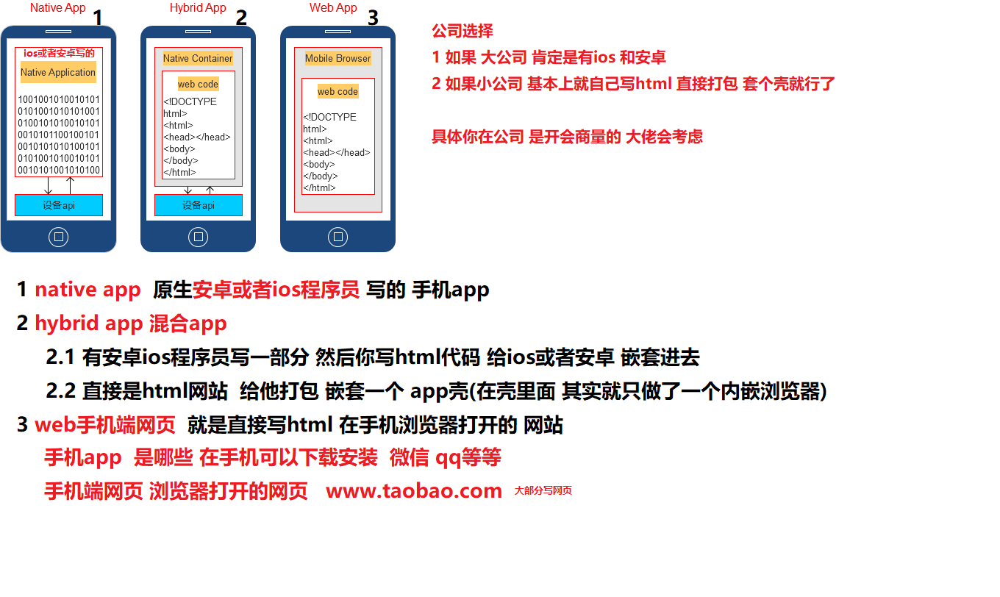
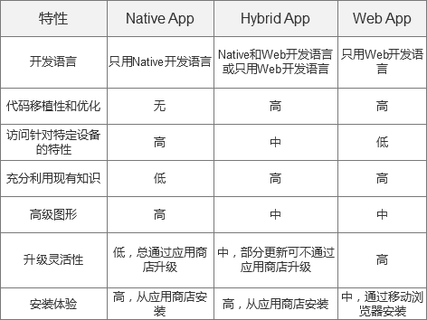

# 1.html

## 1.HTML页面进行重绘和重排(回流)

### 1.1 问题分析

​	该问题主要考核  html中的优化 与 重点概念

### 1.2 核心问题讲解

#### 1.浏览器的运行机制：

1. ==构建DOM树==（parse）：渲染引擎解析HTML文档，首先将标签转换成==DOM树中的DOM== node（包括js生成的标签）**生成内容树**（Content Tree/DOM Tree）；
2. ==构建渲染树==（construct）：解析对应的CSS样式文件信息（包括js生成的样式和外部css文件），而这些文件信息以及HTML中可见的指令（如`<b></b>`）**，构建渲染树**（Rendering Tree/Frame Tree）；render tree中每个NODE都有自己的style，而且render tree不包含隐藏的节点(比如display:none的节点，还有head节点)，因为这些节点不会用于呈现
3. ==布局渲染树==（reflow/layout）：从根节点递归调用，计算每一个元素的大小、位置等，给出每个节点所应该在屏幕上出现的精确坐标；
4. ==绘制渲染树==（paint/repaint）：遍历渲染树，使用UI 层来绘制每个节点。

#### 2.重绘（repaint或redraw）

​	当盒子的位置、大小以及其他属性，例如颜色、字体大小等都确定下来之后，浏览器便把这些原色都按照各自的特性绘制一遍，将内容呈现在页面上。

**重绘是指一个元素外观的改变**所触发的浏览器行为，浏览器会根据元素的新属性重新绘制，使元素呈现新的外观。

 　　**触发重绘的条件：改变元素外观属性。如：color，background-color等。**

**注意：**table及其内部元素可能需要多次计算才能确定好其在渲染树中节点的属性值，比同等元素要多花两倍时间，这就是我们尽量避免使用table布局页面的原因之一。

#### 3.重排（重构/回流/reflow）

当渲染树中的一部分(或全部)因为元素的**规模尺寸，布局，隐藏等改变而需要重新构建, 这就称为回流(reflow)**。每个页面至少需要一次回流，就是在页面第一次加载的时候。

#### 4.重绘和重排的关系

在回流的时候，浏览器会使渲染树中受到影响的部分失效，并重新构造这部分渲染树，完成回流后，浏览器会重新绘制受影响的部分到屏幕中，该过程称为重绘。

所以，**重排必定会引发重绘**，但重绘不一定会引发重排。

#### 5. 触发重排的条件

任何页面布局和几何属性的改变都会触发重排

　　1、页面渲染初始化；(无法避免)

　　2、添加或删除可见的DOM元素；

　　3、元素位置的改变，或者使用动画；

　　4、元素尺寸的改变——大小，外边距，边框；

　　5、浏览器窗口尺寸的变化（resize事件发生时）；

　　6、填充内容的改变，比如文本的改变或图片大小改变而引起的计算值宽度和高度的改变；

　　7、读取某些元素属性：（offsetLeft/Top/Height/Width,　clientTop/Left/Width/Height,　scrollTop/Left/Width/Height,　width/height,　getComputedStyle(),　currentStyle(IE)　)

**重绘重排的代价：耗时，导致浏览器卡慢。**

### 1.3 问题扩展

**优化：**　　

1、浏览器自己的优化：浏览器会维护1个队列，把所有会引起回流、重绘的操作放入这个队列，等队列中的操作到了一定的数量或者到了一定的时间间隔，浏览器就会flush队列，进行一个批处理。这样就会让多次的回流、重绘变成一次回流重绘。

2、我们要注意的优化：我们要减少重绘和重排就是要减少对渲染树的操作，则我们可以合并多次的DOM和样式的修改。并减少对style样式的请求。

（1）**直接改变元素的className**

（2）display：none；先设置元素为display：none；然后进行页面布局等操作；设置完成后将元素设置为display：block；这样的话就只引发两次重绘和重排；

（3）使用cloneNode(true or false) 和 replaceChild 技术，引发一次回流和重绘；

（4）**将需要多次重排的元素，position属性设为absolute或fixed**，元素脱离了文档流，它的变化不会影响到其他元素；

（5）如果需要创建多个DOM节点，可以使用DocumentFragment**创建完后一次性的加入document；**

### 1.4 结合项目中使用

  ```js
// 举个例子  这么一个思路 建议不要边循环边渲染
var fragment = document.createDocumentFragment();
    for(let i=0;i<100;i++){

      var li = document.createElement('li');

      li.innerHTML = 'apple'+i;

      fragment.appendChild(li);

    }
    document.getElementById('fruit').appendChild(fragment);
  ```

## 2.网页验证码的作用

### 2.1 核心问题

1  验证码是目前大多网站所支持并使用于注册登录的。就在于其作用能有效**防止恶意登录注册**，验证码每次都不同,

这就可以排除,用其他病毒或者软件自动申请用户及自动登陆.有效防止这种问题。

2  短信验证码等可以验证用户的合法性

### 2.2 问题扩展

   这些功能怎么做？

​     1 智能选图  文字点选   短信  滑动 等一般  都是购买的服务

​     2 图片文字验证码  这个 后台可以做 比如 php  java等  当然也可以去购买

 总之：他和后端关系很大  基本 对于前端来说  就是  发送ajax 就行

### 2.3  结合项目中使用

 比如 短信  聚合  <https://www.juhe.cn/>

​         1 前端 点击发送验证码  提交手机 到后台 

​          2  后台 拿到前端发来的手机  调用购买的  短信接口 就可以发送验证码到手机上了

   比如 滑动验证码 极验  [文档]( https://www.geetest.com/Sensebot?utm_campaign=sem%E8%A1%8C%E4%B8%BA%E9%AA%8C%E8%AF%81&bd_vid=9865356497840709924)     [前端部署](https://docs.geetest.com/install/deploy/client/web)

​            购买后 前端只需要引入js文件  然后 按照文档 写上就行   

## 3.flex布局

### 3.1核心分析

flex属性是flex-grow, flex-shrink 和 flex-basis的简写，默认值为0 1 auto。后两个属性可选。

**flex-grow ：**flex-grow属性定义盒子的**放大**比例，默认为0 不放大  其他数字按比例放大

**flex-shrink：**如果所有项目的flex-shrink属性都为1，当空间不足时，都将**等比例缩小**。如果一个项目的flex-shrink属性为0，其他项目都为1，则空间不足时，前者**0的不缩小 其他缩小**

**flex-basis**属性定义了在分配多余空间之前，项目占据的主轴空间（main size）提前写的宽高大小。浏览器根据这个属性，计算主轴是否有多余空间。它的默认值为auto，即项目的本来大小。可以写px

.item{

​	flex:none|[<'flex-grow'><'flex-shrink'>?||<'flex-basis'>]

 }

该属性有两个快捷值：auto (1 1 auto) 和 none (0 0 auto)。

建议优先使用这个属性，而不是单独写三个分离的属性，因为浏览器会推算相关值。

### 3.2  结合项目中使用


#### 

```css
      /* 父盒子 开启 flex 子元素默认一行 
    弹性布局的盒子 如果不够现实 会默认伸缩
     */
    .box{
      display: flex;
      /* flex-wrap  wrap强制换行  nowrap 不换*/
      flex-wrap: wrap;
     
    }

    .item{
      width: 33.3333%;
      height: 125px;
      display: flex;
      /* 换成竖排 */
      flex-direction: column;
      /* 主轴居中 */
      justify-content: center; 
      align-items: center;
      border-left: 1px solid #eee;
      border-bottom: 1px solid #eee;
      box-sizing: border-box;
    }
    .item img {
      width: 35px ;
    }
    .item p {
      padding: 10px 0;
    }
```

## 4 移动端部署--网站部署

### 4.1 问题分析

上线部署问题

把你在你的电脑写的代码  上传到 公司买的服务器上

  需要 npm run build  生成代码

build 的代码 复制上传到 服务器特定文件夹 比如www里

### 4.2 核心问题

      1 直接把build下的 html css这些放到根路径 直接就行了
      2 如果你是放到某个文件夹 不是直接放到根路径 
         那么 一般你需要yarn bulid打包的  配置路径
        文档：https://www.jianshu.com/p/db914c668142

   如果是linux服务器  可以使用 ssh 或者 ftp 去上传 html css js 到服务器
   如果是windows服务器  可以使用 远程桌面连接 或者 ftp  上传到 服务器

**vue react如果 history模式下面  刷新 404 了  就需要服务器配置路由重写 指向index.html才可以** 

apache  服务器 配置  .htaccess 文件 设置重写

nginx 也需要配置 服务器

## 5.移动端的兼容（安卓和iOS手机）

### 5.1怎么判断是安卓还是 ios

```
//获取浏览器的userAgent,并转化为小写
var ua = navigator.userAgent.toLowerCase();
//判断是否是苹果手机，是则是true
var isIos = (ua.indexOf('iphone') != -1) || (ua.indexOf('ipad') != -1);
if(isIos){
   做苹果手机兼容
}else{
  做安卓
}
```

### 5.2 兼容问题

1.禁止图片点击放大

部分安卓手机点击图片会放大，如需要禁止放大，只需要设置css属性

```
img{ 
    pointer-events: none; 
} 
```

这个会让img标签的点击事件失效，如果想要给图片添加点击事件就要给上面再写一层

2.禁止 iOS 识别长串数字为电话

```
<meta name="format-detection" content="telephone=no">
```

3.禁止复制、选中文本

```
设置CSS属性 -webkit-user-select:none
```

4.一些情况下对非可点击元素如(label,span）监听点击事件，不会在IOS下触发，css增加cursor:pointer就搞定了
5.上下拉动滚动条时卡顿、慢

```
body {
-webkit-overflow-scrolling: touch;
overflow-scrolling: touch;
}

```

Android3+和iOS5+支持CSS3的新属性为overflow-scrolling

6 安卓不会自动播放视频

```
安卓autoplay没效果 需要手动触发一下
window.addEventListener('touchstart', function(){
	audio.play(); // 需要主动调用一下js 让视频播放
}, false);
```

7.半透明的遮罩层改为全透明

在ios上，当点击一个链接或者通过js绑定了点击事件的元素时，会出现一个半透明的背景，当手指离开屏幕，该灰色背景消失，出现“闪屏”

```
html, body {
    -webkit-tap-highlight-color: rgba(0,0,0,0);
}
```

## 6.Hybrid项目开发流程

### 6.1 混合开发概述

Hybrid App主要以JS+Native两者相互调用为主，从开发层面实现“一次开发，多处运行”的机制，成为真正适合跨平台的开发。Hybrid App兼具了Native App良好用户体验的优势，也兼具了Web App使用HTML5跨平台开发低成本的优势。

目前已经有众多Hybrid App开发成功应用，比如美团、爱奇艺、微信等知名移动应用，都是采用Hybrid App开发模式。

### 6.2 移动应用开发的三种方式比较

移动应用开发的方式，目前主要有三种：

- Native App： 本地应用程序（原生App）
- Web App：网页应用程序（移动web）
- Hybrid App：混合应用程序（混合App）





### 6.3 混合开发框架和层次结构图


1）移动终端web壳（以下简称“壳”）：壳是使用操作系统的 API 来创建嵌入式 HTML的渲染引擎。壳主要功能是定义Android应用程序与网页之间的接口，允许网页中的JavaScript调用Android应用程序，提供基于web的应用程序的Android API，将Web嵌入到Android应用程序中。

2）前端交互js：包括基础功能js和业务功能js。

3）前端适配器：适配不同的终端：Pad、android、ios、wap。

