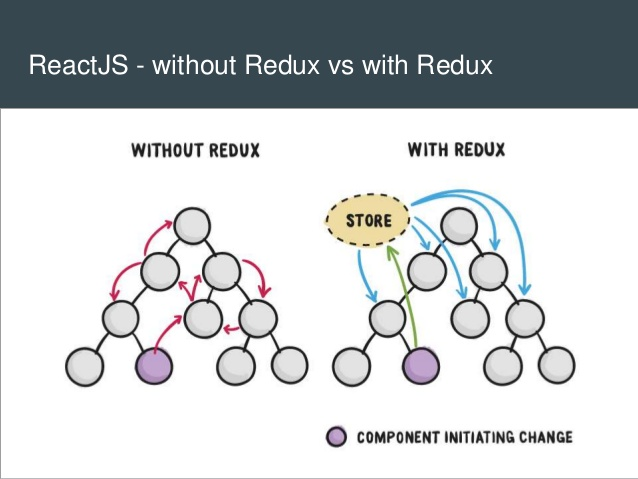

### 1. Redux 是如何将 State 注入到 React 组件上去


#### 问题分析

- React：用于构建用户界面的 JavaScript 库（负责组件的 UI 界面渲染的库）
- Redux：JavaScript 状态容器（负责管理数据的工具）

-> 回顾一下 Redux 的用法


[**React-Redux**](https://www.redux.org.cn/)

扩展：[vuejs-redux](https://github.com/titouancreach/vuejs-redux) ,  [ng-redux](https://github.com/angular-redux/ng-redux)

> 结论：Redux 是一个独立的库，与 React 并没有直接关系，是 React-Redux 将它们俩联系起来的

**Redux 解决了什么问题？**



> 结论： Redux 的出现其实就是解决了复杂应用的状态管理问题，可以**跨层级任意传递数据**。


#### 问题详解

**Redux 的原理**

Redux 就是一个经典的**发布订阅器**。

```js
Button.addEventListener('click', () => { ... })  // 订阅 -- 当触发 A 的时候 就执行 B
Button.removeEventListener('click', () => { ... }) // 取消订阅 - 当触发 A 的时候，不再执行 B
Button.onClick // 发布 -- 触发 A

```


Redux 核心源码

```js
/**
 * 
 * @param {Function} reducer   reducer
 * @param {any} preloadedState 初始化的 state，用的相对较少，一般在服务端渲染的时候使用
 * @param {Function} enhancer  中间件
 */
export default function createStore(reducer, preloadedState, enhancer) {
  // 实现第二个形参选填
  // 只有当第二参数传入的是中间件才会执行下面的代码
  if (typeof preloadedState === 'function' && typeof enhancer === 'undefined') {
    enhancer = preloadedState;
    preloadedState = undefined;
  }
  
  let currentReducer = reducer;
  let currentState = preloadedState; // 整个应用所有的 State 都存储在这个变量里
  let currentListeners = []; // 订阅传进来的的回调函数 <=>  Button.addEventListener('click', () => { ... })

  // 这是一个很重要的设计
  let nextListeners = currentListeners;
 
  function getState() {
    return currentState;
  }

  function subscribe(listener) {
  
    if (nextListeners === currentListeners) {
      // 浅复制
      // 实际上 nextListeners 就是 currentListeners，避免直接操作 currentListeners，因为
      // 其他地方会用到 currentListeners，从而造成数据不一致。
      nextListeners = [...currentListeners];
    }
    nextListeners.push(listener);
		
    return function unsubscribe() {
       if (nextListeners === currentListeners) {
        // 浅复制
        nextListeners = [...currentListeners];
      }

      const index = nextListeners.indexOf(listener);
      nextListeners.splice(index, 1);
    }
  }
// Button.addEventListener('click', () => { ... })
// Button.removeEventListener('click', () => { ... })

  function dispatch(action) {
    currentState = currentReducer(currentState, action); // 调用 reducer 来更新数据
   
    const listeners = (currentListeners = nextListeners); // 保证当前的 listeners 是最新的
    
    for (let i = 0; i < listeners.length; i++) {
      listeners[i](); // 依次执行回调函数
    }

    return action;
  }

  // 手动触发一次 dispatch，初始化
  dispatch({type: 'INIT'});

  return {
    getState,
    dispatch,
    subscribe,
  }
}
```

> 总结：**Redux 就是帮我们用一个变量存储所有的 State，并且提供了发布功能来修改数据，以及订阅功能来触发回调（但是回调之后干嘛？自己解决）。**


**React-Redux 做了什么事情?**