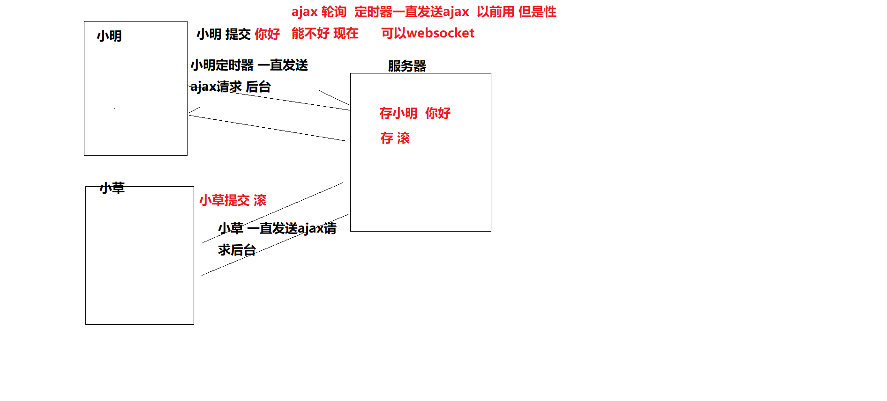

## 1.cookie

### 1.1 核心分析

cookie： cookie机制 客户端浏览器会把Cookie保存起来。当浏览器再请求该网站时，浏览器把请求的网址连同该Cookie一同提交给服务器。

**HTTP协议本身是无状态的**。什么是无状态呢，即服务器无法判断用户身份。Cookie实际上是一小段的文本信息（key-value格式）。客户端向服务器发起请求，如果服务器需要记录该用户状态，就使用response向客户端浏览器颁发一个Cookie。客户端浏览器会把Cookie保存起来。当浏览器再请求该网站时，浏览器把请求的网址连同该Cookie一同提交给服务器。**服务器检查该Cookie，以此来辨认用户等状态**。

cookie 做什么

一般用来存储数据  比如 用户的登录状态  不过现在经常用token 和localStorage了

```js
//  document.cookie="键=值; expires=过期时间"
// cookie 后端会操作 但是 前端也可以操作的
document.cookie="username=zs"
// 写一次 就多一个cookie
document.cookie="age=18"
//  获取
console.log( document.cookie )//字符串形式  username=zs; age=18
// 就需要split拆分处理字符串 获取 username  或者age 
```

###   1.2 locastorage   cookie

####  cookie 

  1 存的数据量小 2 默认浏览器关掉就过期了 但是可以自己设置过期时间 3 不太安全(每次请求头会带上)

####  localstorage

 1 存的数据量大 2 不过期 除非你删掉

 cookie是很久以前的技术 那时候用来存储用户登录 现在 locastorage 存token来操作
 注意：cookie 跨域有问题 现在都是 用 locastorage 存token 统一


## 2 浏览器缓存原理

### 2.1 核心分析

缓存： 浏览器可能会把你上一次的代码 存起来  你再次访问 就没有去拿新代码 而是 直接拿的缓存

强缓存不发请求到服务器 直接拿缓存

协商缓存会发请求到服务器 服务器告诉你， 去拿缓存 ，就拿， 不拿缓存就拿新的代码。

####   1 浏览器缓存 可以通过后台设置响应头控制

     浏览器是会有缓存的 
        分别是强制缓存和协商缓存 都可以通过后台设置响应头控制
         1 强缓存：不会向服务器发送请求，直接从缓存中读取资源 每次访问本地缓存直接验证看是否过期
               强缓存可以通过设置两种 HTTP Header 实现：Expires过期时间 和 Cache-Control缓存控制。
               Cache-Control:max-age=300  缓存300秒
         2 协商缓存(Last-Modified / If-Modified-Since和Etag / If-None-Match)
    		协商缓存命中，服务器会将这个请求返回，但是不会返回这个资源的数据 而是告诉客户端可以直接从缓存拿
    		
    强制缓存优先于协商缓存进行，
      若强制缓存(Expires和Cache-Control)生效则直接使用缓存，
    
     若不生效则进行后台设置头 协商缓存(Last-Modified / If-Modified-Since和Etag / If-None-Match)，
    
    1、浏览器在加载资源时，先根据这个资源的一些  http header  判断它是否强缓存，强缓存如果命中，浏览器直接从自己的缓存中读取资源，不会发请求到服务器。比如某个css文件，如果浏览器在加载它所在的网页时，这个css文件的缓存配置命中了强缓存，浏览器就直接从缓存中加载这个css，连请求都不会发送到网页所在服务器。
    
    2、当强缓存过期的时候，浏览器一定会发送一个请求到服务器，通过服务器端依据资源的另外一些http header验证这个资源是否命中协商缓存，如果协商缓存命中，服务器会将这个请求返回，但是不会返回这个资源的数据，而是告诉客户端可以直接从缓存中加载这个资源，于是浏览器就又会从自己的缓存中去加载这个资源。 
    3 强缓存与协商缓存的共同点是：如果命中，都是从客户端缓存中加载资源，而不是从服务器加载资源数据；区别是：强缓存不发请求到服务器，协商缓存会发请求到服务器。
    4 当协商缓存也没有命中的时候，浏览器直接从服务器加载资源数据。
    
     那么代表该请求的缓存失效，返回200，重新返回资源和缓存标识，
    
      再存入浏览器缓存中；生效则返回304，继续使用缓存

####   2 服务器缓存

​      服务器 可以 主动把 需要缓存的数据或者页面内容 存到 redis(类似数据库 比数据库快) 中 
​     后面可以从里面取  就不去数据库拿了

####   3 html5 有个manifest 也可以缓存 但是不常用

**注意**

协商缓存跟强缓存不一样，强缓存不发请求到服务器，所以有时候资源更新了浏览器还不知道，但是协商缓存会发请求到服务器，所以资源是否更新，服务器肯定知道。大部分web服务器都默认开启协商缓存

## 3. H5离线存储 manHifest

### 3.1 核心分析

HTML5提出的一个新的特性：离线存储。通过离线存储，我们可以通过把需要离线存储在本地的文件列在一个manifest配置文件中，这样即使在离线的情况下，用户也可以正常看见网页。

 在 application  ----  application cache里面可以看见

### 3.2使用

1  在需要离线缓存存储的页面 加上  manifest = "cache.manifest"

```
<!DOCTYPE HTML>
<html manifest = "cache.manifest">
...
</html>
```

2 在根目录 新建文件 cache.manifest 并写上对应代码

```
CACHE MANIFEST
#v0.11

CACHE:

js/app.js
css/style.css

NETWORK:
resourse/logo.png

FALLBACK:
/ /offline.html
```

离线存储的manifest一般由三个部分组成:

1. CACHE:表示需要离线存储的资源列表，由于包含manifest文件的页面将被自动离线存储，所以不需要把页面自身也列出来。 **会在当前浏览器存上**
2. NETWORK:表示在它下面列出来的资源只有在在线的情况下才能访问，他们**不会被离线存储**，所以在离线情况下无法使用这些资源。不过，如果在CACHE和NETWORK中有一个相同的资源，那么这个资源还是会被离线存储，也就是说CACHE的优先级更高。
3. FALLBACK:表示如果访问第一个资源失败，那么就使用第二个资源来替换他，比如上面这个文件表示的就是如果**访问根目录下任何一个资源失败了，那么就去访问offline.html**。

## 4.websocket实现原理

### 4.1 核心分析

#### 1.即时通讯 实现原理有两种 

1 ajax 轮询    使用定时器 每隔1s时间 发送ajax到后台

2 websocket(常用) 有一个好用的封装的 socket.io
  一般 在公司就是直接买一个就行 一般 只需要引入 他的js 就可以了



#### 2.什么是websocket

Websocket是应用层第七层上的一个应用层协议，WebSocket 的最大特点就是，服务器可以主动向客户端推送信息，客户端也可以主动向服务器发送信息，是真正的双向平等对话。

HTTP 有 1.1 和 1.0 之说，也就是所谓的 keep-alive ，把多个 HTTP 请求合并为一个，但是 Websocket 其实是一个新协议，跟 HTTP 协议基本没有关系，只是为了兼容现有浏览器，所以使用了 HTTP 。

客户端首先会向服务端发送一个 HTTP 请求，包含一个 Upgrade 请求头来告知服务端客户端想要建立一个 WebSocket 连接

```js
    var websocket;
        var i = 0;
        if (window.WebSocket) {
          // 原生js就支持的  
          // WebSocket 建立链接后 就不会在断  相当于打电话 只要不挂断就一直可以通讯
          // 1 前端必须按照步骤写上链接WebSocket 2 后台也需要对应链接上WebSocket
          // 对应我们来说 有封装了sockect.io 他就是封装 WebSocket
          // 1 new WebSocket
            websocket = new WebSocket('ws://127.0.0.1:3000');

            //2 连接建立 websocket.onopen
            websocket.onopen = function (evevt) {
                console.log("WebSocket 链接上了");
                $('.show-area').append('<p class="bg-info message"><i class="glyphicon glyphicon-info-sign"></i>Connected to WebSocket server!</p>');
            }
            //3 收到后台发来消息就会执行 websocket.onmessage 
            websocket.onmessage = function (event) {
              // 在这里就 解析判断 后台返回什么数据 对应操作
                var msg = JSON.parse(event.data); //解析收到的json消息数据

                var type = msg.type; // 消息类型
                var umsg = msg.message; //消息文本
                var uname = msg.name; //发送人
                i++;
                if (type == 'usermsg') {
                    $('.show-area').append('<p class="bg-success message"><i class="glyphicon glyphicon-user"></i><a name="' + i + '"></a><span class="label label-primary">' + uname + ' : </span>' + umsg + '</p>');
                }
                if (type == 'system') {
                    $('.show-area').append('<p class="bg-warning message"><a name="' + i + '"></a><i class="glyphicon glyphicon-info-sign"></i>' + umsg + '</p>');
                }

                $('#message').val('');
                window.location.hash = '#' + i;
            }

            //发生错误 链接出错
            websocket.onerror = function (event) {
                i++;
                console.log("Connected to WebSocket server error");
                $('.show-area').append('<p class="bg-danger message"><a name="' + i + '"></a><i class="glyphicon glyphicon-info-sign"></i>Connect to WebSocket server error.</p>');
                window.location.hash = '#' + i;
            }

            //连接关闭 关闭链接
            websocket.onclose = function (event) {
                i++;
                console.log('websocket Connection Closed. ');
                $('.show-area').append('<p class="bg-warning message"><a name="' + i + '"></a><i class="glyphicon glyphicon-info-sign"></i>websocket Connection Closed.</p>');
                window.location.hash = '#' + i;
            }
```


```js
  <script src="/socket.io/socket.io.js"></script>
  <script>
    // 前端 html js代码
    // 1 引入 socket.io.js 
    // 2 调用io链接  var socket = io() // 相当于new websocket io给我们封装了
    // 3 发消息到后台 socket.emit("自己定义的", 参数) 
    // 4 接受消息 socket.on("自己定义的", function(msg) {})
    var name   = prompt("请输入你的昵称：");
    var socket = io()
    
    //发送昵称给后端，并更改网页title
    socket.emit("join", name)
    document.title = name + "的群聊"

    socket.on("join", function (user) {
      addLine(user + " 加入了群聊")
    })

    //接收到服务器发来的message事件
    socket.on("message", function(msg) {
      addLine(msg)
    })

    //当发送按钮被点击时
    $('form').submit(function () {
      var msg = $("#m").val() //获取用户输入的信息
      socket.emit("message", msg) //将消息发送给服务器
      $("#m").val("") //置空消息框
      return false //阻止form提交
    })

    function addLine(msg) {
      $('#messages').append($('<li>').text(msg));
    }
  </script>
```


#### 3.WebSocket 特点

- 建立在 TCP 协议之上，服务器端的实现比较容易。
- 与 HTTP 协议有着良好的兼容性。默认端口也是80和443，并且握手阶段采用 HTTP 协议，因此握手时不容易屏蔽，能通过各种 HTTP 代理服务器。
- 数据格式比较轻量，性能开销小，通信高效。
- 可以发送文本，也可以发送二进制数据。
- 没有同源限制，客户端可以与任意服务器通信。
- 协议标识符是ws（如果加密，则为wss），服务器网址就是 URL。

前端需要 链接websocket   后端也需要链接  两个才可以通讯 所以这个事  必须前后端配合  

