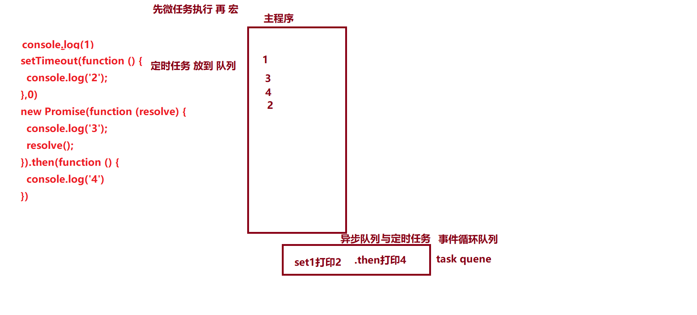

## 1 事件执行的机制(eventLoop)

### 1.1 核心分析

#### 1.同步 异步 

 同步  :代码从上往下执行 遇见 同步 就会一直等 等到完成 才会继续走
 异步  :代码从上往下执行 遇见异步 就先走了  异步的代码后面执行

     异步代码和定时代码 都会等待 主程序执行完毕 再开始
     哪些异步操作 1 定时器延时器 2 ajax 3 事件处理(绑定的onclick等)  4 nodejs 读取文件也有异步 5.promise

```js
   console.log(1)
   $.ajax({
     url:"./php/ok.php",
    success:function(res){
       console.log('ajax结果',res)
       console.log(2)
     }
  })
 console.log(3)   // 1 3 2 
```


#### 2  Js 代码执行机制

- 所有同步任务都在主线程上的栈中执行。
- 主线程之外，还存在一个"任务队列"（task queue）。只要异步任务有了运行结果，就在"任务队列"之中放置一个事件。
- 一旦"栈"中的所有同步任务执行完毕，系统就会读取"任务队列"，选择出需要首先执行的任务（由浏览器决定，并不按序）。

#### 3  宏任务与微任务

1. MacroTask（宏观Task） **setTimeout, setInterval**, , requestAnimationFrame, I/O
2. MicroTask（微观任务） process.nextTick, **Promise**, Object.observe, MutationObserver
3. **先同步 再取出第一个宏任务执行 所有的相关微任务总会在下一个宏任务之前全部执行完毕   如果遇见 就  ==先微后宏==**



### 1.2示例

```js
 console.log('1');
    // 延时器 放到事件队列里面   宏任务
    setTimeout(function () {
      console.log('2');
      new Promise(function (resolve) {
        console.log('3');
        resolve();
      }).then(function () {
        console.log('4')
      })
    },0)
    // promise new promise立刻执行 但是 then 会放到事件队列 微任务
    new Promise(function (resolve) {
      console.log('5');
      resolve();
    }).then(function () {
      console.log('6')
    })
    // 延时器 放到事件队列里面   宏任务
    setTimeout(function () {
      console.log('7');
      new Promise(function (resolve) {
        console.log('8');
        resolve();
      }).then(function () {
        console.log('9')
      })
      console.log('10')
    },0)
   
    console.log('11')
    // 1  5 11 6 2 3  4 7 8  10 9
    //1 此时事件队列代码 有一个 then 6 两个 延时器setTimeout
    //2 先微后宏 执行 then 6 
    //3 剩下 两个 延时器setTimeout  先上面 再下面
    //4 上面的setTimeout  2 3 虽然里面有 then 4 但是记住一个宏任务里面必须会执行完微任务
    //5 下面的setTimeout
```


## 2 对async、await的理解，内部原理

### 2.1 核心分析

####   1.地狱回调

```js
// 要求 第一个ajax 成功之后 第二个发送ajax  再来第三个....
// 如果一直嵌套就是 地狱回调
      $.ajax({
             url:"./php/ok.php",
             success:function(res){
               console.log('ajax结果111',res)
                   $.ajax({
                     url:"./php/ok.php",
                     success:function(res){
                       console.log('ajax结果2222',res)
                       $.ajax({
                         url:"./php/ok.php",
                         success:function(res){
                           console.log('ajax结果2222',res)
                           $.ajax({
                               url:"./php/ok.php",
                               success:function(res){
                                 console.log('ajax结果2222',res)
           } }) } }) }})} })
```

#### 2.可以使用promise 解决地狱回调

```js
  let p1=new Promise(function(resolve,reject) {
               // resolve 是成功的函数
               // reject  是失败的函数
      // p1 是new的 promise 实例  他有固定写
      // p1.then(成功的函数resolve,失败的函数reject)
      // p1.then(function(){},function(){})
  })
  
          let p1=new Promise(function(resolve,reject) {
              $.ajax({
                  url:"./php/ok.php",
                  success:function(res){
                    resolve(res)
                  }
              })
          })
```

Promise.all(数组,第二个参数函数)

```js
   Primose.all([p1,p2,p3...],function)
  // Primose.all 必须数组里面的所有的 promise执行完毕 才成功 
```

Primose.race([p1,p2,p3...],function)

```js
 Primose.race([p1,p2,p3...],function)
// Primose.race  只要 数组里面的 任何一个 成功 整个race就 执行了
```

#### 3.axios 就是 把 发送ajax 用promise封装了一下

**==ajax +promise  解决地狱回调 顺便简单封装axios==** 

```js
   function axios(){
          let p1=new Promise(function(resolve,reject) {
              $.ajax({
                  url:"./php/ok.php",
                  success:function(res){
                    resolve(res)
                  }
              })
          })
   return p1
     // axios返回一个 promise
 }
 // axios() 调用axios函数 得到 p1  new的promise
  axios().then(function(res){
      console.log('结果',res)
  })
```

#### 4.async  await 的使用  就可以省略掉then 

 **==async/await使得异步代码看起来像同步代码==**

```js
//点击 发送ajax
document.getElementById("btn").onclick= async ()=>{
            // 使用axios  麻烦
            // axios().then(function(res){
            //   console.log('结果',res)
            // })
     let res=await axios();// 这里会等待成功 才执行下面
      console.log('结果',res)
 }
```

#### 5. async +await 原理  generate+yield

async 函数是什么？

它就是 Generator 函数的语法糖。

```js
 // Generator方式的函数 里面的代码是 分段执行 看到yield 就给你分一段
      function* helloWorldGenerator() {
        yield 'hello'; // yield 类似 暂停标记
        yield 'world';
        return 'ending';
      }

  var hw = helloWorldGenerator();//hw 返回一个
      // console.log(hw);// 这个函数的结果 是 ending吗？不是 因为代码是暂停的 是一个暂停标记 指向hello
      console.log(hw.next()) //next拿出这个暂停的值 hello
      console.log(hw.next()) //world
      console.log(hw.next()) //ending
      console.log(hw.next()) //undefined
```

### 2. 2 总结

`async`函数返回一个 Promise 对象，可以使用`then`方法添加回调函数。当函数执行的时候，一旦遇到`await`就会先返回，等到异步操作完成，再接着执行函数体内后面的语句。

[阮老师文档](http://es6.ruanyifeng.com/#docs/async)

 axios 请求 配合 async await  拿到数据

#### 


