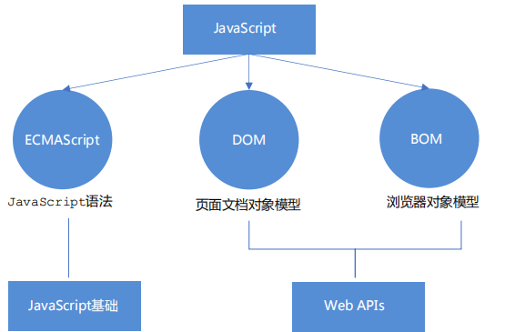
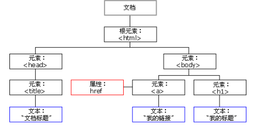
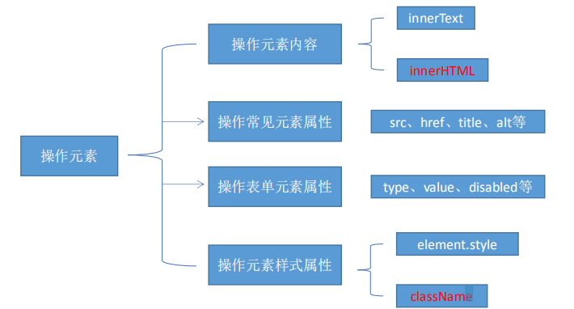
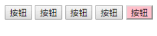
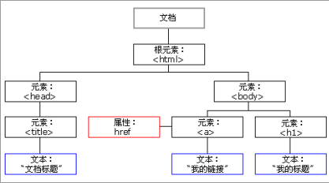
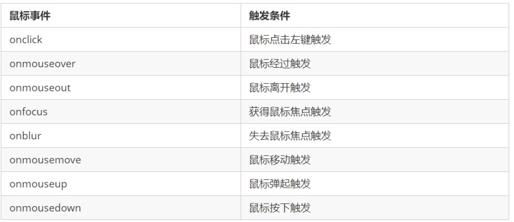

# DOM




## 1. DOM 简介

### 1.1什么是 DOM

文档对象模型（Document Object Model，简称 DOM），是 W3C 组织推荐的处理可扩展标记语言（HTML 或者XML）的标准编程接口。

通过这些 DOM 接口可以改变网页的内容、结构和样式。

### 1.2 DOM 树



文档：一个页面就是一个文档，DOM 中使用 document 表示 

元素：页面中的所有标签都是元素，DOM 中使用 element 表示 

节点：网页中的所有内容都是节点（标签、属性、文本、注释等），DOM 中使用 node 表示

## 2.获取元素

### 2.1根据 ID 获取 getElementById() 

```js
语法：document.getElementById(id)
作用：根据ID获取元素对象
参数：id值，区分大小写的字符串
返回值：元素对象 或 null
```
```html
<body>
    <div id="time">2019-9-9</div>
    <script>
        // 因为我们文档页面从上往下加载，所以先得有标签 所以我们script写到标签的下面
        var timer = document.getElementById('time');
        console.log(timer);
        console.log(typeof timer);
        // console.dir 打印我们返回的元素对象 更好的查看里面的属性和方法
        console.dir(timer);
    </script>
</body>
```

### 2.2根据标签名获取 getElementsByTagName()

```js
语法：document.getElementsByTagName('标签名') 或者 element.getElementsByTagName('标签名') 
作用：根据标签名获取元素对象
参数：标签名
返回值：元素对象集合（伪数组，数组元素是元素对象）
```

```html
<body>
    <ul>
        <li>知否知否，应是等你好久11</li>
        <li>知否知否，应是等你好久22</li>
        <li>知否知否，应是等你好久33</li>
        <li>知否知否，应是等你好久44</li>
        <li>知否知否，应是等你好久55</li>
    </ul>
    <ul id="nav">
        <li>生僻字</li>
        <li>生僻字</li>
        <li>生僻字</li>
        <li>生僻字</li>
        <li>生僻字</li>
    </ul>
    <script>
        // 1.返回的是 获取过来元素对象的集合 以伪数组的形式存储的
        var lis = document.getElementsByTagName('li');
        console.log(lis);
        console.log(lis[0]);
        // 2. 我们想要依次打印里面的元素对象我们可以采取遍历的方式
        for (var i = 0; i < lis.length; i++) {
            console.log(lis[i]);
        }
        // 3. element.getElementsByTagName()  可以得到这个元素里面的某些标签
        var nav = document.getElementById('nav'); // 这个获得nav 元素
        var navLis = nav.getElementsByTagName('li');
        console.log(navLis);
    </script>
</body>
```

注意：
1. 因为得到的是一个对象的集合，所以我们想要操作里面的元素就需要遍历。
2. 得到元素对象是动态的
3. 如果获取不到元素,则返回为空的伪数组(因为获取不到对象)

### 2.3通过 HTML5 新增的方法获取 

```js
1. document.getElementsByClassName('类名')；// 根据类名返回元素对象集合
2. document.querySelector('选择器'); // 根据指定选择器返回第一个元素对象
3. document.querySelectorAll('选择器'); // 根据指定选择器返回
```
querySelector 和 querySelectorAll里面的选择器需要加符号,比如:document.querySelector('#nav');

```html
<body>
    <div class="box">盒子1</div>
    <div class="box">盒子2</div>
    <div id="nav">
        <ul>
            <li>首页</li>
            <li>产品</li>
        </ul>
    </div>
    <script>
        // 1. getElementsByClassName 根据类名获得某些元素集合
        var boxs = document.getElementsByClassName('box');
        console.log(boxs);
        // 2. querySelector 返回指定选择器的第一个元素对象  切记 里面的选择器需要加符号 .box  #nav
        var firstBox = document.querySelector('.box');
        console.log(firstBox);
        var nav = document.querySelector('#nav');
        console.log(nav);
        var li = document.querySelector('li');
        console.log(li);
        // 3. querySelectorAll()返回指定选择器的所有元素对象集合
        var allBox = document.querySelectorAll('.box');
        console.log(allBox);
        var lis = document.querySelectorAll('li');
        console.log(lis);
    </script>
</body>
```

### 2.4特殊元素获取

**获取body元素**
```js
 doucumnet.body // 返回body元素对象
```
**获取html元素**

```js
document.documentElement // 返回html元素对象
```

## 3.事件

### 3.1事件三要素

触发--- 响应机制

网页中的每个元素都可以产生某些可以触发 JavaScript 的事件

1. 事件源（谁）：触发事件的元素
- 事件类型（什么事件）： 例如 click 点击事件
- 事件处理程序（做啥）：事件触发后要执行的代码(函数形式)，事件处理函数

```html
<body>
    <button id="btn">唐伯虎</button>
    <script>
        // 点击一个按钮，弹出对话框
        // 1. 事件是有三部分组成  事件源  事件类型  事件处理程序   我们也称为事件三要素
        //(1) 事件源 事件被触发的对象   谁  按钮
        var btn = document.getElementById('btn');
        //(2) 事件类型  如何触发 什么事件 比如鼠标点击(onclick) 还是鼠标经过 还是键盘按下
        //(3) 事件处理程序  通过一个函数赋值的方式 完成
        btn.onclick = function() {
            alert('点秋香');
        }
    </script>
</body>
```

### 3.2执行事件的步骤

1. 获取事件源

2. 注册事件（绑定事件）

3. 添加事件处理程序（采取函数赋值形式）

4. ```html
   <body>
       <div>123</div>
       <script>
           // 执行事件步骤
           // 点击div 控制台输出 我被选中了
           // 1. 获取事件源
           var div = document.querySelector('div');
           // 2.绑定事件 注册事件
           // div.onclick 
           // 3.添加事件处理程序 
           div.onclick = function() {
               console.log('我被选中了');
           }
       </script>
   </body>
   ```

### 3.3常见的鼠标事件


## 4.操作元素 

### 4.1 改变元素内容（获取或设置）
`element.innerText`

从起始位置到终止位置的内容, 但它**去除 html 标签，** 同时空格和换行也会去掉
`
element.innerHTML
`
起始位置到终止位置的全部内容，**包括 html 标签**，同时保留空格和换行

```html
<body>
    <div></div>
    <p>
        我是文字
        <span>123</span>
    </p>
    <script>
        // innerText 和 innerHTML的区别 
        // 1. innerText 不识别html标签 非标准  去除空格和换行
        var div = document.querySelector('div');
        // div.innerText = '<strong>今天是：</strong> 2019';
        // 2. innerHTML 识别html标签 W3C标准 保留空格和换行的
        div.innerHTML = '<strong>今天是：</strong> 2019';
        // 这两个属性是可读写的  可以获取元素里面的内容
        var p = document.querySelector('p');
        console.log(p.innerText);
        console.log(p.innerHTML);
    </script>
</body>
```

### 4.2 常用元素的属性操作
>1. innerText、innerHTML 改变元素内容
>2. src、href
>3. id、alt、title

**获取属性的值**

> 元素对象.属性名

**设置属性的值**

> 元素对象.属性名 = 值
```html
<body>
    <button id="ldh">刘德华</button>
    <button id="zxy">张学友</button> <br>
    
    <script>
        // 修改元素属性  src
        // 1. 获取元素
        var ldh = document.getElementById('ldh');
        var zxy = document.getElementById('zxy');
        var img = document.querySelector('img');
        // 2. 注册事件  处理程序
        zxy.onclick = function() {
            img.src = 'images/zxy.jpg';
            img.title = '张学友思密达';
        }
        ldh.onclick = function() {
            img.src = 'images/ldh.jpg';
            img.title = '刘德华';
        }
    </script>
</body>
```
### 4.3 表单元素的属性操作

`type、value、checked、selected、disabled`

**获取属性的值**

> 元素对象.属性名

**设置属性的值**

> 元素对象.属性名 = 值
>
> 表单元素中有一些属性如：disabled、checked、selected，元素对象的这些属性的值是布尔型。

```html
<body>
    <button>按钮</button>
    <input type="text" value="输入内容">
    <script>
        // 1. 获取元素
        var btn = document.querySelector('button');
        var input = document.querySelector('input');
        // 2. 注册事件 处理程序
        btn.onclick = function() {
            // 表单里面的值 文字内容是通过 value 来修改的
            input.value = '被点击了';
            // 如果想要某个表单被禁用 不能再点击 disabled  我们想要这个按钮 button禁用
            // btn.disabled = true;
            this.disabled = true;
            // this 指向的是事件函数的调用者 btn
        }
    </script>
</body>
```

### 4.4 样式属性操作

我们可以通过 JS 修改元素的大小、颜色、位置等样式。


1. element.style 行内样式操作
2. element.className 类名样式操作


#### 方式1：通过操作style属性

> 元素对象的style属性也是一个对象！
>
> 元素对象.style.样式属性 = 值;

```html
<body>
    <div></div>
    <script>
        // 1. 获取元素
        var div = document.querySelector('div');
        // 2. 注册事件 处理程序
        div.onclick = function() {
            // div.style里面的属性 采取驼峰命名法 
            this.style.backgroundColor = 'purple';
            this.style.width = '250px';
        }
    </script>
</body>
```

#### 方式2：通过操作className属性

> 元素对象.className = 值;
> 因为class是关键字，所有使用className。


```html
<body>
    <div class="first">文本</div>
    <script>
        // 1. 使用 element.style 获得修改元素样式  如果样式比较少 或者 功能简单的情况下使用
        var test = document.querySelector('div');
        test.onclick = function() {
            // this.style.backgroundColor = 'purple';
            // this.style.color = '#fff';
            // this.style.fontSize = '25px';
            // this.style.marginTop = '100px';

            // 2. 我们可以通过 修改元素的className更改元素的样式 适合于样式较多或者功能复杂的情况
            // 3. 如果想要保留原先的类名，我们可以这么做 多类名选择器
            // this.className = 'change';
            this.className = 'first change';
        }
    </script>
</body>
```


### 4.5 排他思想
如果有同一组元素，我们想要某一个元素实现某种样式， 需要用到循环的排他思想算法：

1. 所有元素全部清除样式（干掉其他人）

2. 给当前元素设置样式 （留下我自己）

3. 注意顺序不能颠倒，首先干掉其他人，再设置自己


```html
    <button>按钮1</button>
    <button>按钮2</button>
    <button>按钮3</button>
    <button>按钮4</button>
    <button>按钮5</button>
    <script>
        // 1. 获取所有按钮元素
        var btns = document.getElementsByTagName('button');
        // btns得到的是伪数组  里面的每一个元素 btns[i]
        for (var i = 0; i < btns.length; i++) {
            btns[i].onclick = function() {
                // (1) 我们先把所有的按钮背景颜色去掉  干掉所有人
                for (var i = 0; i < btns.length; i++) {
                    btns[i].style.backgroundColor = '';
                }
                // (2) 然后才让当前的元素背景颜色为pink 留下我自己
                this.style.backgroundColor = 'pink';

            }
        }
    </script>
```
### 4.6 自定义属性的操作

#### 1. 获取属性值

>**element.属性** 获取内置属性值（元素本身自带的属性）
>**element.getAttribute(‘属性’)**; 主要获得自定义的属性 （标准） 我们程序员自定义的属性

```js
    <div id="demo" index="1" class="nav"></div>
    <script>
        var div = document.querySelector('div');
        // 1. 获取元素的属性值
        // (1) element.属性
        console.log(div.id);
        //(2) element.getAttribute('属性')  get得到获取 attribute 属性的意思 我们程序员自己添加的属性我们称为自定义属性 index
        console.log(div.getAttribute('id'));
        console.log(div.getAttribute('index'));
	</script>
```
#### 2. 设置属性值

>**element.属性** 设置内置属性值
>**element.setAttribute(‘属性’)** 主要设置自定义的属性 （标准）
```js
        // (1) element.属性= '值'
        div.id = 'test';
        div.className = 'navs';
        // (2) element.setAttribute('属性', '值');  主要针对于自定义属性
        div.setAttribute('index', 2);
        div.setAttribute('class', 'footer'); // class 特殊  这里面写的就是
```

#### 3. 移除属性
>**element.removeAttribute('属性');**

```js
        //  移除属性 removeAttribute(属性)    
        div.removeAttribute('index');
```
### 4.7 H5自定义属性

保存并使用数据。有些数据可以保存到页面中而不用保存到数据库中。

#### 1. 设置H5自定义属性
```js
//H5规定自定义属性data-开头做为属性名并且赋值。 
<div data-index=“1”></div>
//或者使用 JS 设置
element.setAttribute(‘data-index’, 2)
```

#### 2. 获取H5自定义属性

1. 兼容性获取 element.getAttribute(‘data-index’);
2. H5新增 element.dataset.index 或者 element.dataset[‘index’] ie 11才开始支持

## 5. 节点操作


### 5.1节点操作

获取元素通常使用两种方式：
##### 1. 利用 DOM 提供的方法获取元素
document.getElementById()
document.getElementsByTagName()
document.querySelector 等
逻辑性不强、繁琐

##### 2. 利用节点层级关系获取元素
利用父子兄节点关系获取元素
逻辑性强， 但是兼容性稍差

### 5.2 节点概述

网页中的所有内容都是节点（标签、属性、文本、注释等），在DOM 中，节点使用 node 来表示。



节点至少拥有nodeType（节点类型）、nodeName（节点名称）和nodeValue（节点值）这三个
基本属性。
* 元素节点 nodeType 为 1
* 属性节点 nodeType 为 2
* 文本节点 nodeType 为 3 （文本节点包含文字、空格、换行等）

### 5.3 节点层级

利用 DOM 树可以把节点划分为不同的层级关系，常见的是**父子兄层级关系**。

#### 1. 父级节点
`node.parentNode
`

```html
    <div class="demo">
        <div class="box">
            <span class="erweima">×</span>
        </div>
    </div>
    <script>
        // 1. 父节点 parentNode
        var erweima = document.querySelector('.erweima');
        // var box = document.querySelector('.box');
        // 得到的是离元素最近的父级节点(亲爸爸) 如果找不到父节点就返回为 null
        console.log(erweima.parentNode);
    </script>
```

#### 2. 子节点
##### 所有子节点
`
parentNode.childNodes（标准）
`

##### 子节点
`parentNode.children（非标准）`

```html
    <ul>
        <li>我是li</li>
        <li>我是li</li>
        <li>我是li</li>
        <li>我是li</li>
    </ul>
    <script>
        // DOM 提供的方法（API）获取
        var ul = document.querySelector('ul');
        var lis = ul.querySelectorAll('li');
        // 1. 子节点  childNodes 所有的子节点 包含 元素节点 文本节点等等
        console.log(ul.childNodes);
        console.log(ul.childNodes[0].nodeType);
        console.log(ul.childNodes[1].nodeType);
        // 2. children 获取所有的子元素节点 也是我们实际开发常用的
        console.log(ul.children);
    </script>
```
##### 第一个子节点
`parentNode.firstChild`

##### 最后一个子节点

`parentNode.lastChild`

##### 第一个子元素节点

`parentNode.firstElementChild`

##### 最后一个子元素节点
`parentNode.lastElementChild
`

```html
    <ol>
        <li>我是li1</li>
        <li>我是li2</li>
        <li>我是li3</li>
        <li>我是li4</li>
        <li>我是li5</li>
    </ol>
    <script>
        var ol = document.querySelector('ol');
        // 1. firstChild 第一个子节点 不管是文本节点还是元素节点
        console.log(ol.firstChild);
        console.log(ol.lastChild);
        // 2. firstElementChild 返回第一个子元素节点 ie9才支持
        console.log(ol.firstElementChild);
        console.log(ol.lastElementChild);
        // 3. 实际开发的写法  既没有兼容性问题又返回第一个子元素
        console.log(ol.children[0]);
        console.log(ol.children[ol.children.length - 1]);
    </script>
```


#### 3. 兄弟节点

##### 下一个兄弟元素节点
`node.nextSibling
`

##### 上一个兄弟元素节点
`node.previousSibling`

##### 当前元素下一个兄弟元素节点
`node.nextElementSibling`

##### 当前元素上一个兄弟节点
`node.previousElementSibling`

### 5.4 创建节点
动态创建元素节点。
`document.createElement('tagName')`

### 5.5 添加节点

`node.appendChild(child)`

一个节点添加到指定父节点的子节点列表末尾。类似于 CSS 里面的after 伪元素。

`node.insertBefore(child, 指定元素)`

一个节点添加到父节点的指定子节点前面。类似于 CSS 里面的 before伪元素。

### 5.6 删除节点

`node.removeChild(child)`
从 DOM 中删除一个子节点，返回删除的节点。

### 5.7 复制节点(克隆节点)

`node.cloneNode()`

返回调用该方法的节点的一个副本。 也称为克隆节点/拷贝节点

注意：
1. 如果括号参数为**空或者为 false**，则是**浅拷贝**，即只克隆复制节点本身，**不克隆里面的子节点**。
2. 如果括号参数为 **true** ，则是**深度拷贝**，会**复制节点本身以及里面所有的子节点**。

### 5.8 三种动态创建元素区别

>document.write()
>element.innerHTML
>document.createElement()


区别
1. document.write 是直接将内容写入页面的内容流，但是文档流执行完毕，则它会导致页面**全部重绘**
2. innerHTML 是将内容写入某个 DOM 节点，不会导致页面全部重绘
3. innerHTML **创建多个元素效率更高**（**不要拼接字符串**，采取数组形式拼接），结构稍微复杂
4. createElement() 创建**多个元素效率稍低一点点**，但是结构更清晰
总结：不同浏览器下，innerHTML 效率要比 creatElement 高

## 6. DOM 重点核心
### 6.1 创建
1. document.write
2. innerHTML
3. createElement
### 6.2 增
1. appendChild
2. insertBefore
### 6.3 删
1. removeChild
### 6.4 改

主要修改dom的元素属性，dom元素的内容、属性, 表单的值等
1. 修改元素属性： src、href、title等
2. 修改普通元素内容： innerHTML 、innerText
3. 修改表单元素： value、type、disabled等
4. 修改元素样式： style、className

### 6.5 查

主要获取查询dom的元素
1. DOM提供的API 方法： getElementById、getElementsByTagName 古老用法 不太推荐
2. H5提供的新方法： querySelector、querySelectorAll 提倡
3. 利用节点操作获取元素： 父(parentNode)、子(children)、兄(previousElementSibling、
nextElementSibling) 提倡

### 6.6 属性操作

主要针对于自定义属性。
1. setAttribute：设置dom的属性值
2. getAttribute：得到dom的属性值
3. removeAttribute移除属性

### 6.7 事件操作

给元素注册事件， 采取 事件源.事件类型 = 事件处理程序




