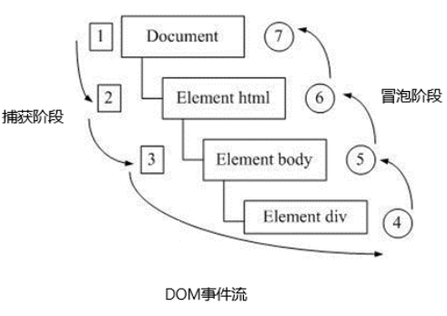
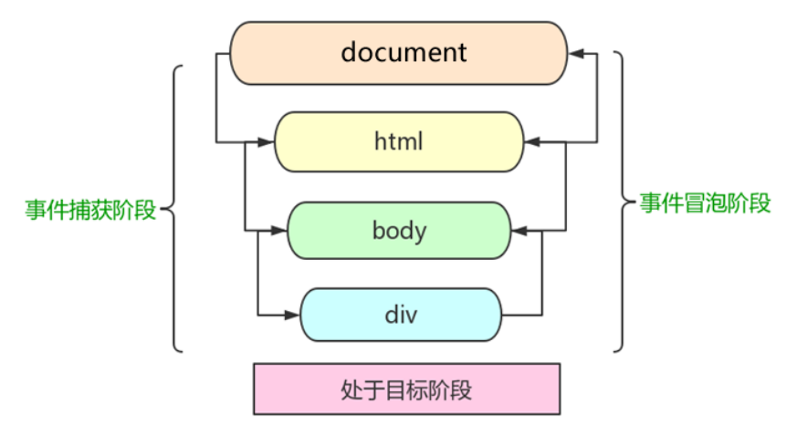
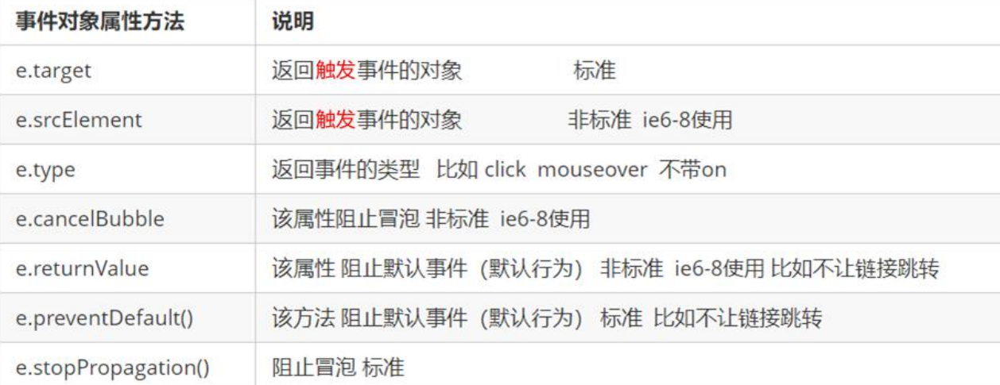
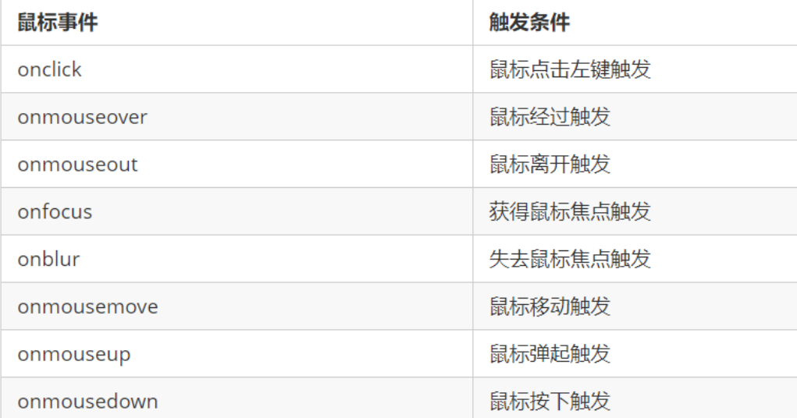
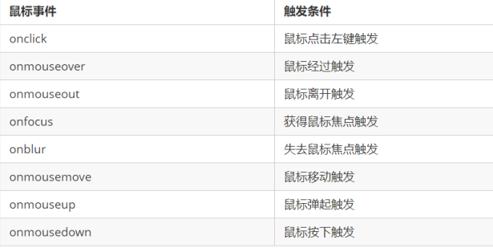

## 1. 注册事件（绑定事件）

### 1.1 注册事件概述
给元素添加事件，称为注册事件或者绑定事件。

#### 1.传统注册方式

利用 on 开头的事件 onclick
```js
<button onclick=“alert('hi~')”></button>
btn.onclick = function() {}
```
特点： 注册事件的唯一性
同一个元素同一个事件只能设置一个处理函数，最
后注册的处理函数将会覆盖前面注册的处理函数

#### 2.方法监听注册方式
w3c 标准 推荐方式
addEventListener() 它是一个方法
IE9 之前的 IE 不支持此方法，可使用 attachEvent() 代替
特点：同一个元素同一个事件可以注册多个监听器
按注册顺序依次执行

### 1.2 addEventListener 事件监听方式

`eventTarget.addEventListener(type, listener[, useCapture])`


eventTarget.addEventListener()方法将指定的监听器注册到 eventTarget（目标对象）上，当该对
象触发指定的事件时，就会执行事件处理函数。
该方法接收三个参数：

1. **type**：事件类型字符串，比如 click 、mouseover ，注意这里不要带 on
2. **listener**：事件处理函数，事件发生时，会调用该监听函数
3. **useCapture**：可选参数，是一个布尔值，默认是 false。学完 DOM 事件流后，我们再进一步学习


### 1.3 attachEvent 事件监听方式

`eventTarget.attachEvent(eventNameWithOn, callback)`

eventTarget.attachEvent()方法将指定的监听器注册到 eventTarget（目标对象） 上，当该对象触
发指定的事件时，指定的回调函数就会被执行。
该方法接收两个参数：

1. eventNameWithOn：事件类型字符串，比如 onclick 、onmouseover ，这里要带 on
2. callback： 事件处理函数，当目标触发事件时回调函数被调用


### 1.4 注册事件兼容性解决方案
```js
function addEventListener(element, eventName, fn) {
// 判断当前浏览器是否支持 addEventListener 方法
if (element.addEventListener) {
element.addEventListener(eventName, fn); // 第三个参数 默认是false
} else if (element.attachEvent) {
element.attachEvent('on' + eventName, fn);
} else {
// 相当于 element.onclick = fn;
element['on' + eventName] = fn;
}

```

## 2. 删除事件（解绑事件）

### 2.1 删除事件的方式

#### 1. 传统注册方式
`eventTarget.onclick = null;`

#### 2. 方法监听注册方式
①` eventTarget.removeEventListener(type, listener[, useCapture]);`
②` eventTarget.detachEvent(eventNameWithOn, callback);`

### 2.2 删除事件兼容性解决方案
```js
function removeEventListener(element, eventName, fn) {
// 判断当前浏览器是否支持 removeEventListener 方法
if (element.removeEventListener) {
element.removeEventListener(eventName, fn); // 第三个参数 默认是false
} else if (element.detachEvent) {
element.detachEvent('on' + eventName, fn);
} else {
element['on' + eventName] = null;
}
```
## 3. DOM事件流

**事件流**描述的是从页面中接收事件的顺序。
事件发生时会在元素节点之间按照特定的顺序传播，这个传播过程即 DOM 事件流。

>DOM 事件流分为3个阶段：
>1. 捕获阶段
>2. 当前目标阶段
>3. 冒泡阶段



我们向水里面扔一块石头，首先它会有一个下降的过程，这个过程就可以理解为从最顶层向事件发生的最具
体元素（目标点）的捕获过程；之后会产生泡泡，会在最低点（ 最具体元素）之后漂浮到水面上，这个过
程相当于事件冒泡。



事件发生时会在元素节点之间按照特定的顺序传播，这个传播过程即 DOM 事件流。
**事件冒泡**

```html
    <div class="father">
        <div class="son">son盒子</div>
    </div>
    <script>
        // onclick 和 attachEvent（ie） 在冒泡阶段触发
        // 冒泡阶段 如果addEventListener 第三个参数是 false 或者 省略 
        // son -> father ->body -> html -> document
        var son = document.querySelector('.son');
		// 给son注册单击事件
        son.addEventListener('click', function() {
            alert('son');
        }, false);
		// 给father注册单击事件
        var father = document.querySelector('.father');
        father.addEventListener('click', function() {
            alert('father');
        }, false);
		// 给document注册单击事件，省略第3个参数
        document.addEventListener('click', function() {
            alert('document');
        })
    </script>
```

**事件捕获**

```html
    <div class="father">
        <div class="son">son盒子</div>
    </div>
    <script>
        // 如果addEventListener() 第三个参数是 true 那么在捕获阶段触发
        // document -> html -> body -> father -> son
         var son = document.querySelector('.son');
		// 给son注册单击事件，第3个参数为true
         son.addEventListener('click', function() {
             alert('son');
         }, true);
         var father = document.querySelector('.father');
		// 给father注册单击事件，第3个参数为true
         father.addEventListener('click', function() {
             alert('father');
         }, true);
		// 给document注册单击事件，第3个参数为true
        document.addEventListener('click', function() {
            alert('document');
        }, true)
    </script>
```

## 4. 事件对象

### 4.1 什么是事件对象
```js
eventTarget.onclick = function(event) {}
eventTarget.addEventListener('click', function(event) {}）
// 这个 event 就是事件对象，我们还喜欢的写成 e 或者 evt
```

事件发生后，跟事件相关的一系列信息数据的集合都放到这个对象里面，这个对象就是事件对象
event，它有很多属性和方法。

1. 谁绑定了这个事件。
2. 鼠标触发事件的话，会得到鼠标的相关信息，如鼠标位置。
3. 键盘触发事件的话，会得到键盘的相关信息，如按了哪个键。


### 4.2 事件对象的使用语法
```js
eventTarget.onclick = function(event) {
// 这个 event 就是事件对象，我们还喜欢的写成 e 或者 evt
}
eventTarget.addEventListener('click', function(event) {
// 这个 event 就是事件对象，我们还喜欢的写成 e 或者 evt
}）
```

这个 event 是个形参，系统帮我们设定为事件对象，不需要传递实参过去。
当我们注册事件时， event 对象就会被系统自动创建，并依次传递给事件监听器（事件处理函数）。

### 4.3 事件对象的兼容性方案

`e = e || window.event;`

### 4.4 事件对象的常见属性和方法



```js
 // 1. e.target 返回的是触发事件的对象（元素）  this 返回的是绑定事件的对象（元素）
// 区别 ： e.target 点击了那个元素，就返回那个元素 this 那个元素绑定了这个点击事件，那么就返回谁
        var div = document.querySelector('div');
        div.addEventListener('click', function(e) {
            console.log(e.target);
            console.log(this);
        })
        var ul = document.querySelector('ul');
        ul.addEventListener('click', function(e) {
                // 我们给ul 绑定了事件  那么this 就指向ul  
                console.log(this);
                // e.target 指向我们点击的那个对象 谁触发了这个事件 我们点击的是li e.target 指向的就是li
                console.log(e.target);
            })
            // 了解兼容性
            // div.onclick = function(e) {
            //     e = e || window.event;
            //     var target = e.target || e.srcElement;
            //     console.log(target);
        // }
    
```
### 4.5阻止默认行为
> html中一些标签有默认行为，例如a标签被单击后，默认会进行页面跳转。

```html
    <a href="http://www.baidu.com">百度</a>
    <script>
        // 2. 阻止默认行为 让链接不跳转 
        var a = document.querySelector('a');
        a.addEventListener('click', function(e) {
             e.preventDefault(); //  dom 标准写法
        });
        // 3. 传统的注册方式
        a.onclick = function(e) {
            // 普通浏览器 e.preventDefault();  方法
            e.preventDefault();
            // 低版本浏览器 ie678  returnValue  属性
            e.returnValue = false;
            // 我们可以利用return false 也能阻止默认行为 没有兼容性问题
            return false;
        }
    </script>
```
## 5. 阻止事件冒泡

### 5.1 阻止事件冒泡的两种方式

事件冒泡：开始时由最具体的元素接收，然后逐级向上传播到到 DOM 最顶层节点。

**阻止事件冒泡**

标准写法：利用事件对象里面的 stopPropagation()方法
`e.stopPropagation()`
非标准写法：IE 6-8 利用事件对象 cancelBubble 属性
`e.cancelBubble = true;`

### 5.2 阻止事件冒泡的兼容性解决方案
```js
if(e && e.stopPropagation){
e.stopPropagation();
}else{
window.event.cancelBubble = true;
}
```
## 6. 事件委托（代理、委派）

不给每个子节点单独设置事件监听器，而是**事件监听器设置在其父节点上**，然后**利用冒泡原理**影响设置每个子节点。
```html
    <ul>
        <li>知否知否，点我应有弹框在手！</li>
        <li>知否知否，点我应有弹框在手！</li>
        <li>知否知否，点我应有弹框在手！</li>
        <li>知否知否，点我应有弹框在手！</li>
        <li>知否知否，点我应有弹框在手！</li>
    </ul>
    <script>
        // 事件委托的核心原理：给父节点添加侦听器， 利用事件冒泡影响每一个子节点
        var ul = document.querySelector('ul');
        ul.addEventListener('click', function(e) {
            // e.target 这个可以得到我们点击的对象
            e.target.style.backgroundColor = 'pink';
        })
    </script>
```
## 7. 常用的鼠标事件
### 7.1 常用的鼠标事件
#### 1.禁止鼠标右键菜单



contextmenu主要控制应该何时显示上下文菜单，主要用于程序员取消默认的上下文菜单
```js
document.addEventListener('contextmenu', function(e) {
e.preventDefault();
})
```
#### 2.禁止鼠标选中（selectstart 开始选中）
```js
document.addEventListener('selectstart', function(e) {
e.preventDefault();
})
```

### 7.2 鼠标事件对象
event对象代表事件的状态，跟事件相关的一系列信息的集合。




### 7.3 获取鼠标在页面的坐标

```html
    <script>
        // 鼠标事件对象 MouseEvent
        document.addEventListener('click', function(e) {
            // 1. client 鼠标在可视区的x和y坐标
            console.log(e.clientX);
            console.log(e.clientY);
            console.log('---------------------');

            // 2. page 鼠标在页面文档的x和y坐标
            console.log(e.pageX);
            console.log(e.pageY);
            console.log('---------------------');

            // 3. screen 鼠标在电脑屏幕的x和y坐标
            console.log(e.screenX);
            console.log(e.screenY);

        })
    </script>
```


## 8. 常用的键盘事件

### 8.1 常用键盘事件
| 键盘事件   | 触发事件 |
| ---------- | -------- |
| onkeyup    | 松开触发 |
| onkeydown  | 按下触发 |
| onkeypress | 按下触发 |


1. 如果使用addEventListener 不需要加 on
2. onkeypress 和前面2个的区别是，它不识别功能键，比如左右箭头，shift 等。
3. 三个事件的执行顺序是： keydown -- keypress --- keyup
### 8.2 键盘事件对象


| 键盘事件对象属性 | 说明        |
| ---------------- | ----------- |
| keycode          | 该键的ASCII |

